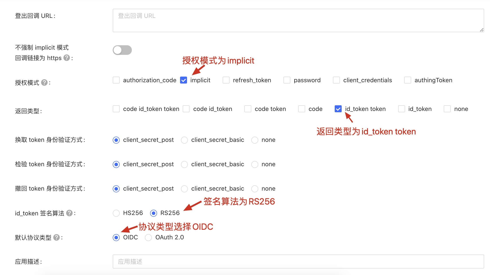
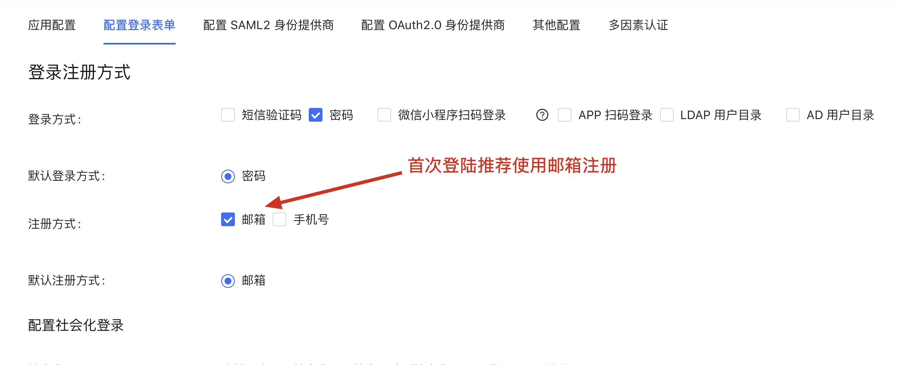
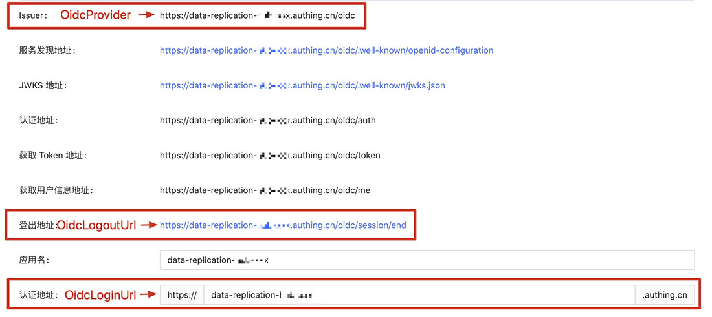
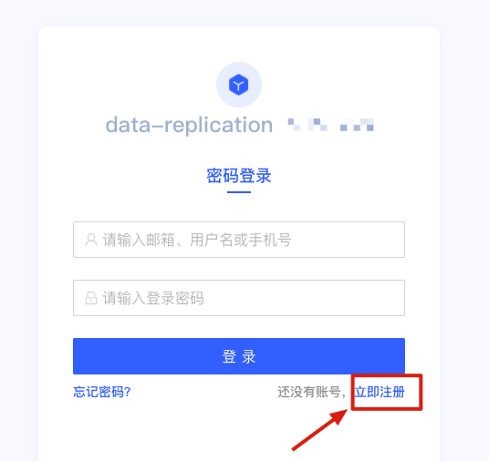

# 在AWS中国区部署 Data Replication Hub

**部署时间:** 大约需要20分钟.

## 部署前提
由于在中国区的网站服务需要有ICP备案，请确保您已经将Data Replication Hub的相关域名已经备案，否则部署完成后，可能无法正常访问服务。

## OpenId认证配置

中国区目前暂时没有上线Cognito User Pool服务，如果要将Data Transfer Hub部署在中国区使用，我们目前支持使用[Authing](http://authing.cn/)作为OpenId的认证服务商提供的认证服务。

### 注册Authing.cn开发者账号
[点击注册](https://docs.authing.cn/quickstart/create-authing-account.html)

### 在Authing.cn中创建OIDC应用
[点击了解如何创建](https://docs.authing.cn/authentication/oidc/create-oidc.html)

**在创建应用的时候的请参考以下配置**

1. 应用配置：

  

2. 配置登陆表单:

  

3. 其他参数根据您的项目需要进行配置或者默认即可

### 部署Data Replication Hub

按照下面的步骤将Data Transfer Hub配置和部署到您的AWS中国区账户中

1. 确保您已经登陆到AWS中国区的[控制台](https://console.amazonaws.cn/console/home).

2. 单击以下按钮以在您的AWS帐户中启动CloudFormation堆栈.

    

3. 点击 **下一步**

4. 填写 **AdminEmail** 参数

5. 打开[Authing控制台](https://console.authing.cn/console)并打开应用配置信息按照下图所示填写在Cloudformation中的OIDC Settings中的参数:

  

6. 填写**OidcTokenValidationUrl**，该URL为 https://<你的应用名>.authing.cn/api/v2/oidc/validate_token ，请查看[文档说明](https://docs.authing.cn/user/token.html#%E5%9C%A8%E7%BA%BF%E9%AA%8C%E8%AF%81-oidc-idtoken)
   
    
7. 点击 **下一步** 然后点击 **创建堆栈**.

### 在Route53中配置域名指向CloudFront

在Route 53和ClouFront中，将Route53中的域名增加解析到CloudFront，并在CloudFron中备用域名 (CNAMEs)

1. 在[Cloudformation](https://console.amazonaws.cn/cloudformation/home)的输出中找到PortalUrl

   

2. 在[CloudFront](https://console.amazonaws.cn/cloudfront/home)中配置您已备案的域名

   

3. 在[Route 53](https://console.amazonaws.cn/route53/home)中将您的域名指向CloudFront

   

### 登录Data Replication Hub

在浏览器中输入您配置的Data Replication Hub的域名，系统会跳转到Authing的认证登录界面，首次登录系统需要登陆账号

  

注册成功后，就可以使用该账号登陆Data Replication Hub了.

### 特别注意

如果没有特别需要，建议在首次登录成功后，在Authing的应用控制台将注册功能关闭，以免产生不必要的注册用户

  
