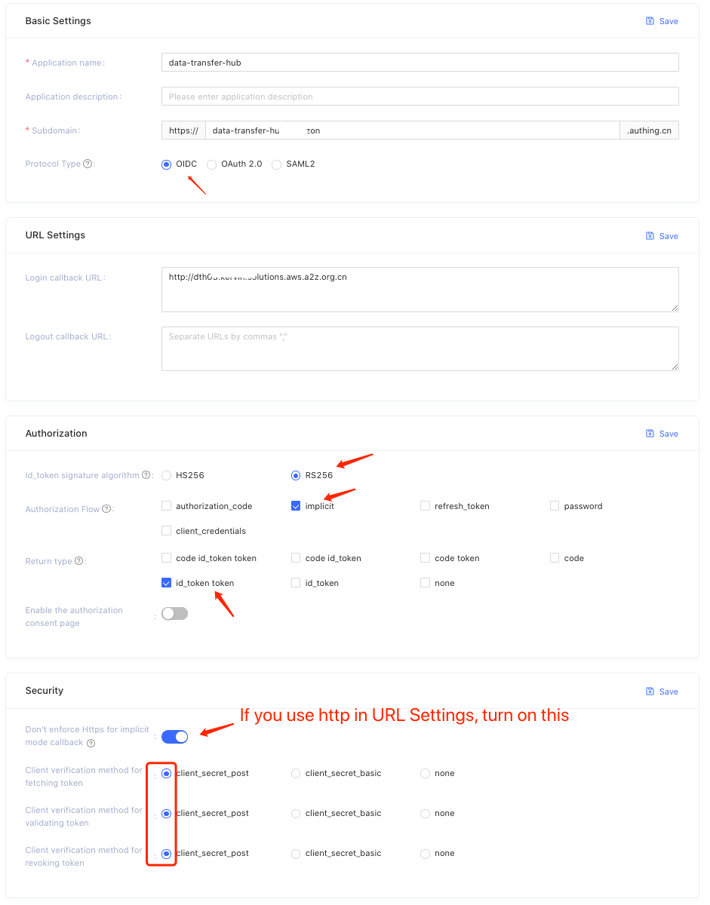
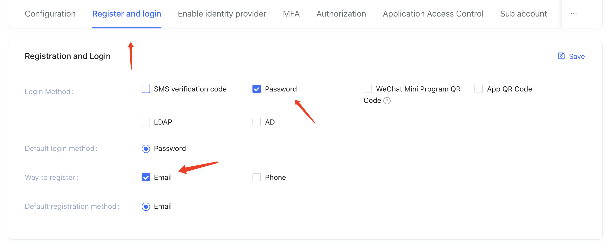
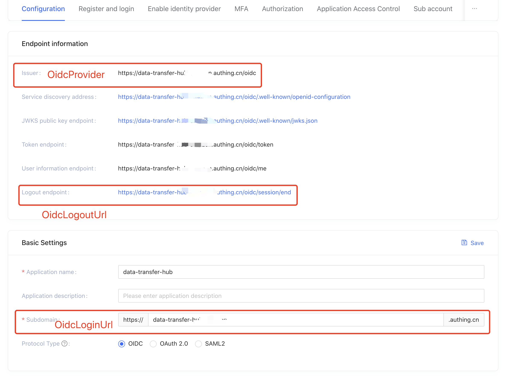
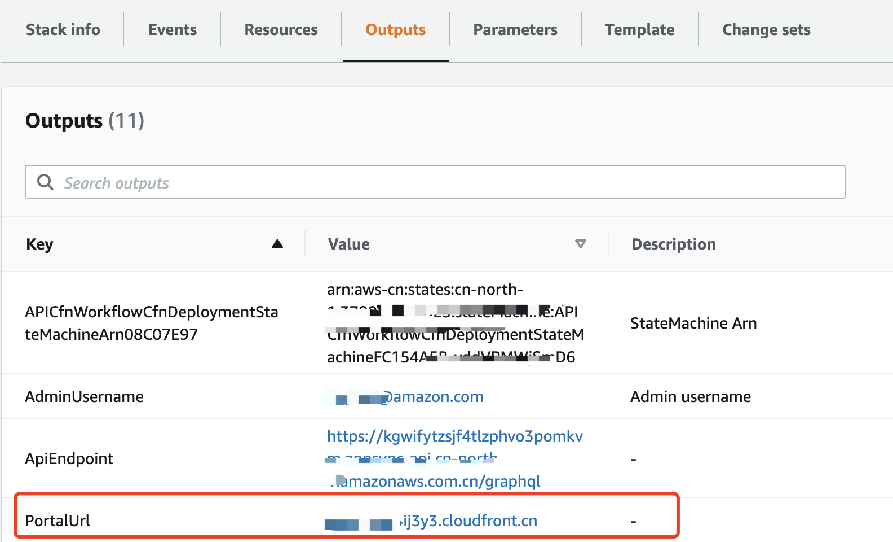
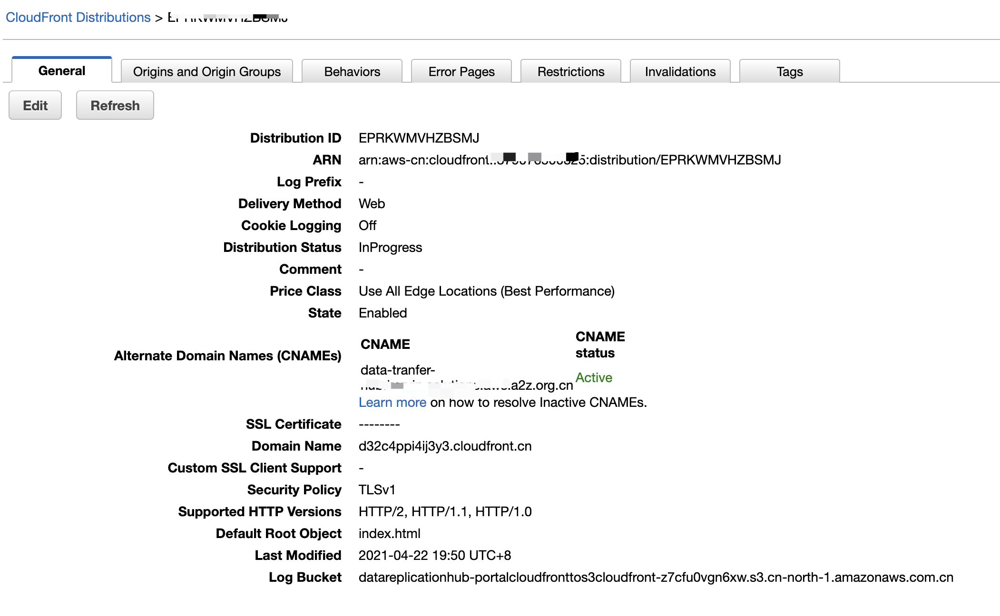
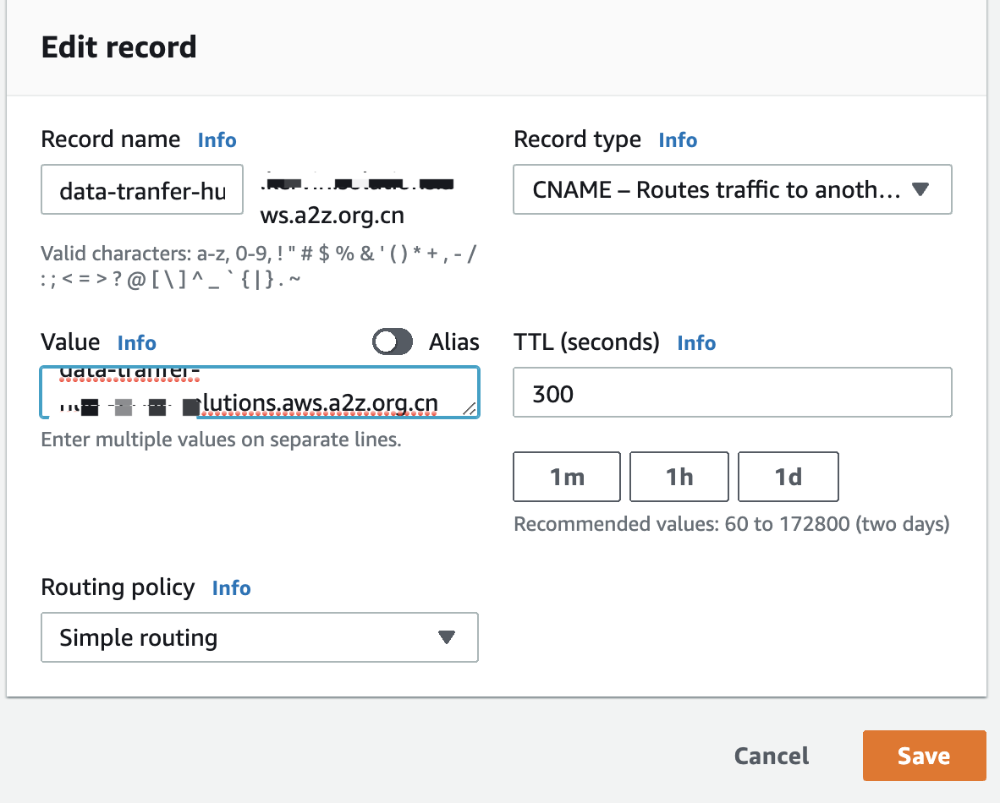
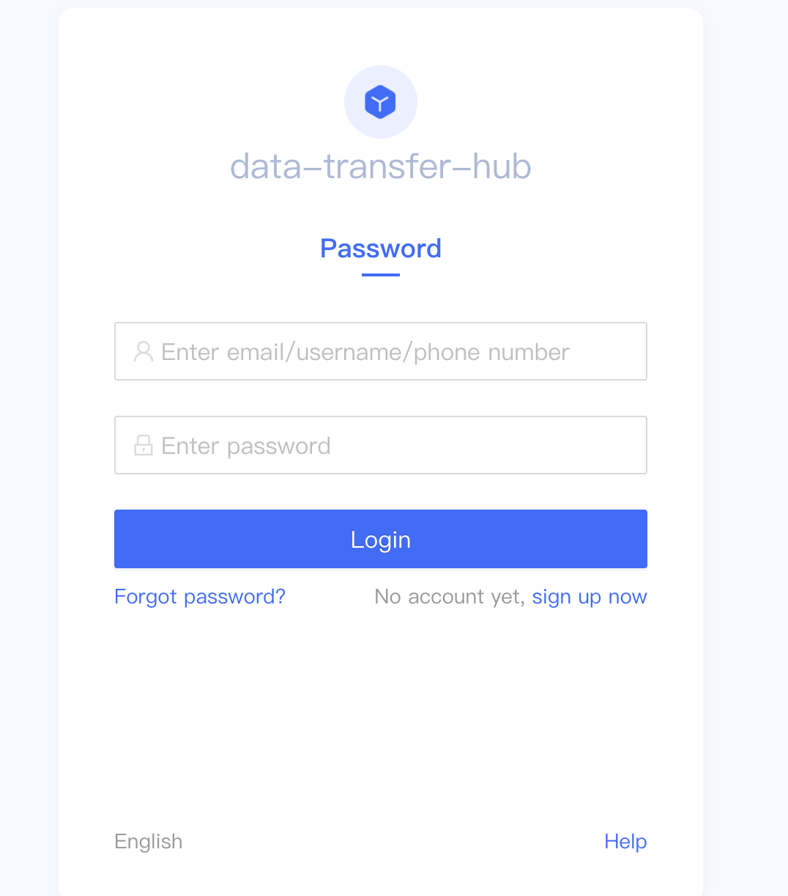
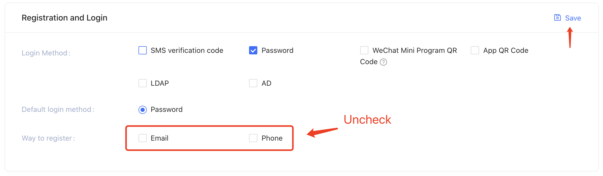

[中文](./DeployInChinaWithAuthing_CN.md)
# Deploy Data Transfer Hub in AWS China Region

**Deployment time:** Takes about 20 minutes.

## Prerequisites
As website services in China require ICP Registering, please make sure that you have registered the relevant domain name of Data Replication Hub. Otherwise, after the deployment is complete, you may not be able to successfully access the service.

## OpenId authentication configuration

The Cognito User Pool service is currently not available in AWS China Region. If you want to deploy Data Transfer Hub in AWS China Region, we currently support the use of [Authing](http://authing.cn/) as the authentication service provided by OpenId's authentication service provider.

### Register Authing.cn developer account
[Click to register](https://docs.authing.cn/quickstart/create-authing-account.html)

### Create OIDC application in Authing.cn
[Click to learn how to create](https://docs.authing.cn/authentication/oidc/create-oidc.html)

**Please refer to the following configuration when creating the OIDC application**

1. Configuration:

  

2. Register and login:

  

3. Other parameters can be configured according to your project needs or defaulted.

### Deploy Data Transfer Hub

Follow the steps below to configure and deploy Data Transfer Hub in your AWS China account.

1. Make sure you have logged in to the [Console](https://console.amazonaws.cn/console/home) of AWS China Region.

2. Click the button below to launch the CloudFormation stack in your AWS account.

    

3. Click **Next**

4. Fill in **AdminEmail**

5. Open the [Authing console](https://console.authing.cn/console) and open the application configuration information and fill in the parameters in the OIDC Settings of Cloudformation as shown in the figure below:

  

6. Fill in **OidcTokenValidationUrl**, the URL is `https://<your application name>.authing.cn/api/v2/oidc/validate_token`, please check [documentation](https://docs.authing.cn/user/token.html#%E5%9C%A8%E7%BA%BF%E9%AA%8C%E8%AF%81-oidc-idtoken)
   
    
7. Click **Next** and then click **Create Stack**.

### Configure the domain name in Amazon Route53 to point to the Amazon CloudFront

Add the domain name in Route53 to CloudFront, and configure the domain name (CNAMEs) in CloudFront.

1. Find the PortalUrl in the Output page of [Cloudformation](https://console.amazonaws.cn/cloudformation/home)

   

2. Configure your registered domain name in [CloudFront](https://console.amazonaws.cn/cloudfront/home)

   

3. Point your domain name to CloudFront in [Route 53](https://console.amazonaws.cn/route53/home)

   

### Log in Data Replication Hub

In the browser, enter the domain name of the Data Replication Hub you configured. And the system will jump to the authentication login page of Authing. You need to log in to the system for the first time.

  

After successful registration, you can use this account to log in to Data Replication Hub.

### Pay Attention

If there is no special need, it is recommended to turn off the registration function in the Authing application console after the first login successfully to avoid unnecessary registered users.

  
