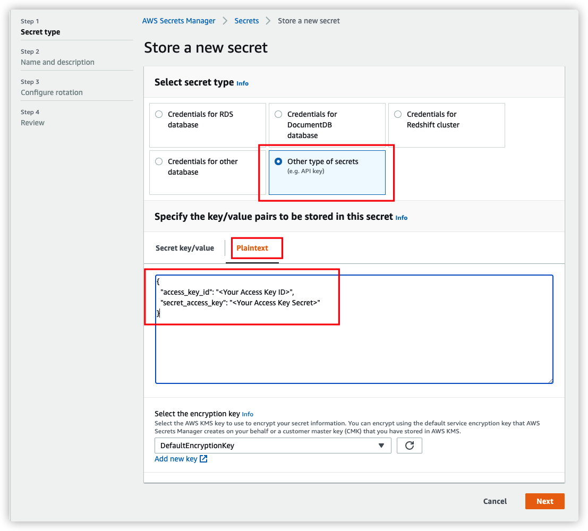

[中文](./S3_DEPLOYMENT_CN.md)

# Deployment Guide

> Note: If you have already deployed the Data Transfer Hub console, please refer directly to [Create Amazon S3 transfer task through Portal](https://awslabs.github.io/data-transfer-hub/en/user-guide/tutorial-s3/).

> This tutorial is a deployment guide for the backend-only version.

## 1. Prepare VPC

This solution can be deployed in both public and private subnets. Using public subnets is recommended.

- If you want to use existing VPC, please make sure the VPC has at least 2 subnets, and both subnets must have public internet access (Either public subnets with internet gateway or private subnets with NAT gateway)

- If you want to create new default VPC for this solution, please go to Step 2 and make sure you have *Create a new VPC for this cluster* selected when you create the cluster.

## 2. Configure credentials

You will need to provide `AccessKeyID` and `SecretAccessKey` (namely `AK/SK`) to read or write bucket in S3 from or to another AWS account or other cloud storage service, and the credential will be stored in AWS Secrets Manager.  You DON'T need to create credential for bucket in the current account you are deploying the solution to.

Go to AWS Management Console > Secrets Manager. From Secrets Manager home page, click **Store a new secret**. For secret type, please use **Other type of secrets**. For key/value paris, please copy and paste below JSON text into the Plaintext section, and change value to your AK/SK accordingly.

```
{
  "access_key_id": "<Your Access Key ID>",
  "secret_access_key": "<Your Access Key Secret>"
}
```



Click Next to specify a secret name, and click Create in teh last step.


> Note that if the AK/SK is for source bucket, **READ** access to bucket is required, if it's for destination bucket, **READ** and **WRITE** access to bucket is required. For Amazon S3, you can refer to [Set up Credential](./IAM-Policy.md)


## 3. Launch AWS Cloudformation Stack

Please follow below steps to deploy this solution via AWS Cloudformation.

1. Sign in to AWS Management Console, switch to the region to deploy the CloudFormation Stack to.

1. Click the following button to launch the CloudFormation Stack in that region.

    - For AWS China Regions

      [](https://console.amazonaws.cn/cloudformation/home#/stacks/create/template?stackName=DTHS3Stack&templateURL=https://solutions-reference.s3.amazonaws.com/data-transfer-hub/latest/DataTransferS3Stack.template)

    - For AWS Global regions

      [](https://console.aws.amazon.com/cloudformation/home#/stacks/create/template?stackName=DTHS3Stack&templateURL=https://solutions-reference.s3.amazonaws.com/data-transfer-hub/latest/DataTransferS3Stack.template)
    
    - For AWS GovCloud (US) Regions

    [](https://console.amazonaws-us-gov.com/cloudformation/home#/stacks/create/template?stackName=DTHS3Stack&templateURL=https://solutions-reference.s3.amazonaws.com/data-transfer-hub/latest/DataTransferS3Stack.template)

1. Click **Next**. Specify values to parameters accordingly. Change the stack name if required.

1. Click **Next**. Configure additional stack options such as tags (Optional). 

1. Click **Next**. Review and confirm acknowledgement,  then click **Create Stack** to start the deployment.

The deployment will take approximately 3-5 minutes.