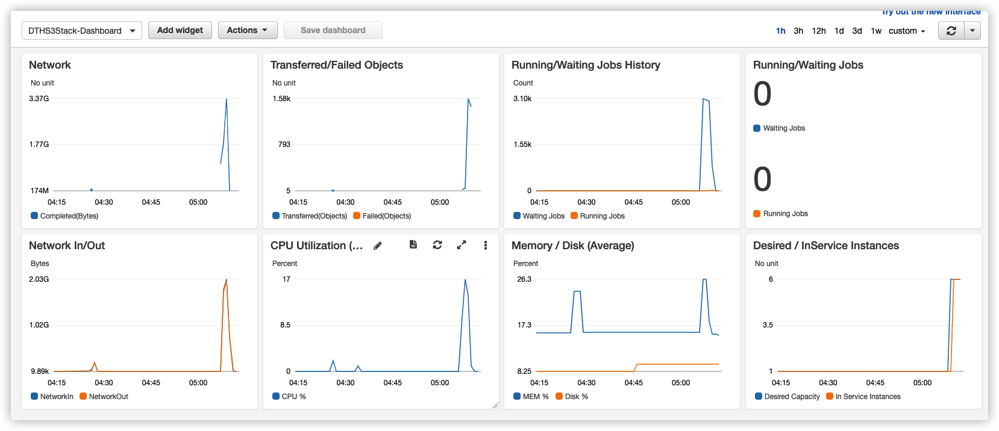

[English](./S3_PLUGIN.md)

# Data Transfer Hub - S3插件

## 目录
* [介绍](#介绍)
* [最新改动](#最新改动)
* [架构](#架构)
* [部署](#部署)
* [FAQ](#faq)
  * [如何监控](#如何监控)
  * [如何调试](#如何调试)
  * [在CloudWatch里没有日志](#在CloudWatch里没有日志)
  * [如何客制化](#如何客制化)
* [已知问题](#已知问题)

## 介绍

[Data Transfer Hub](https://github.com/awslabs/aws-data-replication-hub)，前称是Data Replication Hub，是一个用于从不同的源传输数据到AWS的解决方案。本项目是该方案的其中一款插件（S3插件）。你可以独立部署和运行此插件而无需使用UI。

_本项目（Date Replication Hub - S3 Plugin）是基于[huangzbaws@](https://github.com/huangzbaws) 的 [amazon-s3-resumable-upload](https://github.com/aws-samples/amazon-s3-resumable-upload) 基础上开发的。_

以下是本插件提供的功能列表：

- 在 Amazon S3 中国区和海外区之间传输对象
- 从阿里云OSS /腾讯COS /七牛Kodo 传输对象
- 大文件支持
- 支持S3事件触发
- 支持对象元数据传输
- 支持增量数据传输
- 支持从 S3 兼容对象存储传输数据
- 自动重试和错误处理

## 架构

在AWS Fargate中运行的*Finder* 任务列出了源存储桶和目标存储桶中的所有对象，并确定应复制哪些对象，将在SQS中为每个要复制的对象创建一条消息。 *基于时间的CloudWatch规则*将触发ECS任务每小时运行一次。

此外，本插件也支持S3事件通知，以（实时）触发复制，前提是需要将此插件部署在与源存储桶相同的帐户（和区域）中。 事件消息也将发送到相同的SQS队列。

在EC2中运行的*Worker*任务会消费SQS中的消息，并将对象从源存储桶传输到目标存储桶。你可以根据业务需要, 在Auto Scaling Group里调整使用多少台EC2实例进行数据传输。

如果某个对象或对象的一部分传输失败，则*JobWorker*将在队列中释放该消息，并且该消息在队列中可见后将再次传输该对象（默认可见性超时设置为15分钟，大文件会自动延长)。经过几次尝试，如果传输依然失败，该消息就会被移到Dead Letter Queue并且触发Alarm提醒。

该插件支持传输大文件。它将大文件分成多个小的部分并利用Amazon S3的[multipart upload](https://docs.aws.amazon.com/AmazonS3/latest/dev/mpuoverview.html) 功能进行分段传输，支持断点续传。

> 注意: 此解决方案使用`t4g.micro`实例类型以节省成本。在撰写本文时，此实例类型在US West (Oregon)区的价格为`每小时$0.0084`。请查看[EC2定价](https://aws.amazon.com/ec2/pricing/on-demand/)以获取最新价格。 并且Amazon EC2操作系统将默认启用BBR（Bottleneck Bandwidth and RTT）以提高网络性能。

## 部署

有关此插件的部署的注意事项：:

- 部署本插件会自动在您的AWS账号里创建包括Lambda, DyanomoDB表，ECS任务等
- 部署预计用时3-5分钟
- 一旦部署完成，复制任务就会马上开始

请参考[部署指南](./docs/DEPLOYMENT_CN.md)里的步骤进行部署。

> 注意：如果不再需要数据传输任务，则可以从CloudFormation控制台中删除堆栈。

## FAQ

### 如何监控

**问题**：部署解决方案后，如何监视进度？

**回答**：部署后，将创建一个cloudwatch仪表板供您监视进度，运行/等待作业，网络，已传输/失败的对象等指标将记录在仪表板中。下图是一个示例：

### 如何调试

**问题**：部署完后似乎没有正常运行，该如何调试？

**回答**：

- **对于控制台用户**

    转到**任务**列表页面，然后单击**任务编号**。 您可以在 **日志监控** 部分下看到仪表板和日志。

    Data Transfer Hub 已将 Dashboard 和日志组集成到 Portal 中，您无需跳转到 AWS CloudWatch 控制台即可查看日志。

- **对于 Plugin（纯后端版本）用户**

    部署堆栈时，会要求您输入堆栈名称（默认为DTHS3Stack），大多数资源都会以名称前缀作为堆栈名称创建。例如，队列名称的格式为`<StackName>-S3TransferQueue-<random suffix>`。此插件将创建两个主要日志组。

    - 如果没有数据传输，您需要检查ECS任务日志中是否有问题。以下是调度ECS任务的日志组。您可以在 [错误消息列表](#error-code-list) 中找到更多信息.

        `<StackName>-EC2FinderLogGroup<random suffix>`

    - 以下是所有EC2实例的日志组，您可以找到详细的传输日志。

        `<StackName>-CommonS3RepWorkerLogGroup<random suffix>`

### 在CloudWatch里没有日志

**问题**：我部署完该插件, 但我在在CloudWatch日志组里没有找到任何日志

**回答**：这一定是因为您在部署此解决方案时选择的子网没有公共网络访问权限，因此 Fargate任务无法拉取映像，而EC2实例则无法下载 CloudWatch Agent以将日志发送到 CloudWatch。 请检查您的 VPC 设置（请参阅[部署指南](./docs/DEPLOYMENT_CN.md) 步骤 1）。 修复问题后，您需要手动终止正在运行的此方案的EC2 实例（如果有的话）。之后，Auto Scaling Group将自动启动新实例。

### 如何客制化

**问题**：我想要更改此方案，需要做什么?

**回答**：如果要更改解决方案，可以参考[定制](CUSTOM_BUILD.md) 指南.

> 注意：更多常见问题请参考[实施指南 - 常见问题解答](https://awslabs.github.io/data-transfer-hub/zh/faq/)。