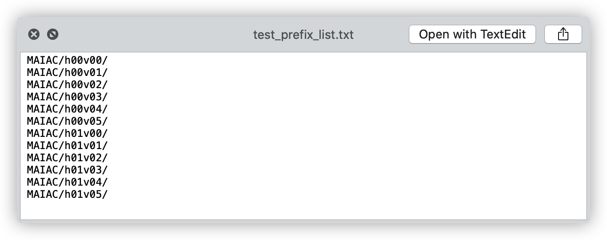
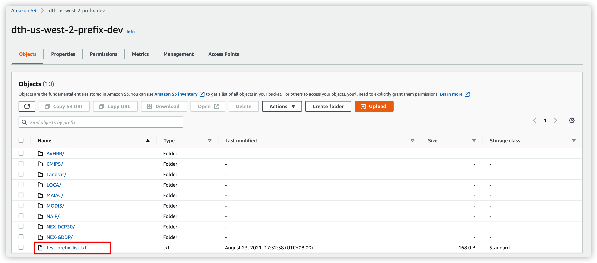
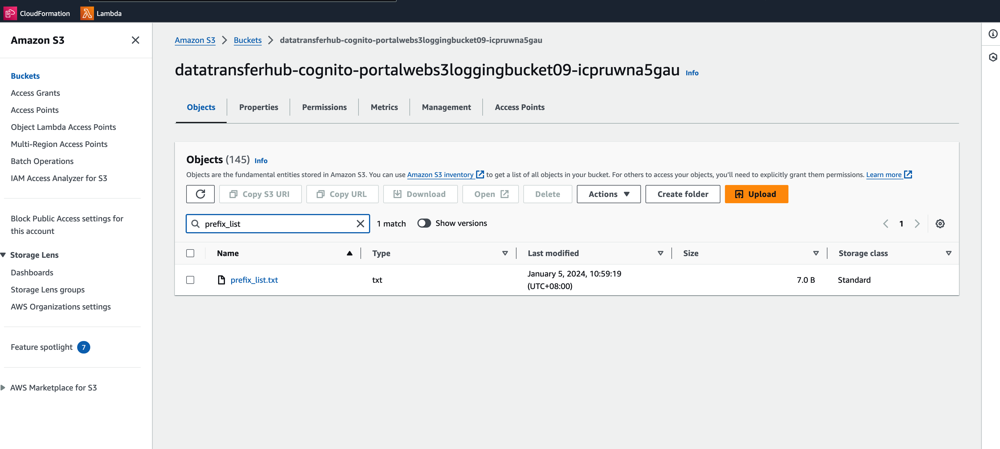
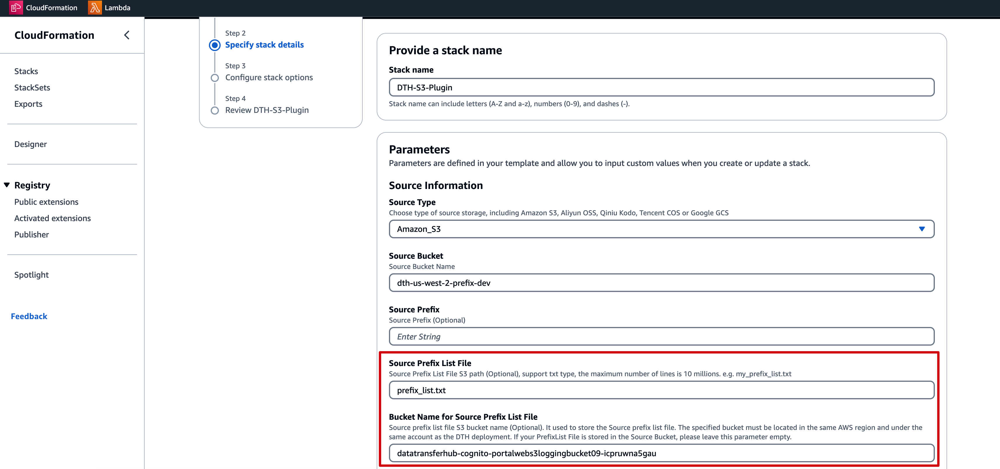

[中文](./USING_PREFIX_LIST_CN.md)

# Using Prefix List File to Filter Data Transmission Job

## Step 1: Create a Prefix List File

Please write the list of prefixes into a Plain Text format file, with one prefix for each line. 

For example:

## Step 2: Uploading the Prefix List File to Your Bucket
> **Note**: Ensure you enter the precise path of the Prefix List File when specifying its location in Step 3.

### Option 1: Uploading the Prefix List File to Your Source Bucket

You can store the prefix list file anywhere within your source bucket. 

### Option 2: Uploading the Prefix List File to a Third Bucket within the Same Region and Account as the Data Transfer Hub

You have the flexibility to place the prefix list file in any location within a third bucket. It is essential that this third bucket shares the same region and account as the Data Transfer Hub.

For those using the Data Transfer Hub portal, simply click the provided link to navigate directly to the third bucket.

## Step 3: Configuring the CloudFormation Stack Template

Enter the path of the Prefix List File in the provided input field. 
If your Prefix List File is located in the Source Bucket, leave the `Bucket Name for Source Prefix List File` parameter blank.

