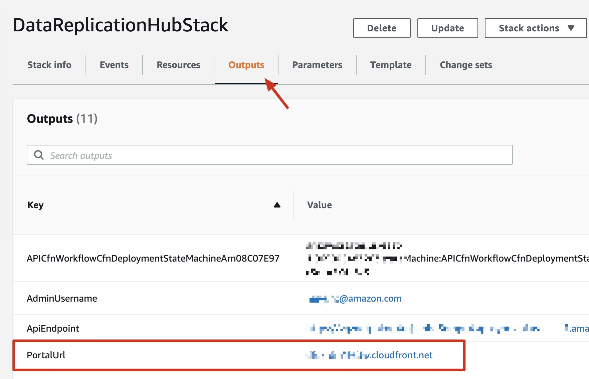

# Data Transfer Hub 用户指南

## 登陆到 Data Transfer Hub 界面
成功创建cloudformation堆栈后，您将收到一封电子邮件通知，其中包含用于登录的临时密码，用户名是您启动cloudformation时设置的AdminEmail。

界面的网址可在cloudformation堆栈的输出选项中找到，请参见以下屏幕截图：



### 登陆界面

1. 在浏览器中输入界面的URL
2. 使用您的用户名和临时密码登录
3. 更改临时密码
4. 验证电子邮件（可选）

## 创建一个S3数据复制任务

S3复制任务支持以下数据源：
* 另一个区中的Amazon S3存储桶
* 阿里云OSS
* 腾讯COS
* 七牛云Kodo
* Google存储服务（仅适用于Amazon S3全球区域）

S3插件使用凭证从AWS另一个区的Amazon S3或其他云提供商中复制数据。 您的凭据将存储在 [AWS Secrets Manager](https://docs.aws.amazon.com/secretsmanager/latest/userguide/intro.html).

### 配置凭证

1. 打开 **[Secrets Manager](https://console.aws.amazon.com/secretsmanager/home#)** 控制台
1. 点击左侧边栏的 **Secrets**
1. 点击 **Store a new secret** 按钮
1. 在密钥类型中，选择 **Other type of secrets**
1. 在 **Plaintext** 选项卡中输入AKSK, 该凭证需要按以下的格式
    ```
    {
      "access_key_id": "<Your Access Key ID>",
      "secret_access_key": "<Your Access Key Secret>"
    }
    ```
1. 点击 **Next**
1. 输入密钥名称 **Secret name**, 例如: `drh-credentials`
1. 点击 **Next**
1. 选择 **Disable automatic rotation**
1. 点击 **Store** 完成创建

对于其他云提供商，凭据格式应保持不变。

### 在网页界面创建复制任务

1. 单击任务列表页面上的**创建任务**按钮。
1. 在**选择引擎类型**页面上选择**Amazon S3**，然后选择**下一步**。
1. 指定**数据源类型**。
1. 填写任务详细信息页面上的字段，然后单击**下一步**。 对于Amazon S3源类型，您应该选择**是否S3存储桶在当前AWS账户?**。
1. 查看任务详细信息，然后单击**创建任务**按钮。
1. 浏览器将转到**任务列表**页面。

## 更多详细教程

1. [将Amazon S3 的数据从北京 (cn-north-1) 传输到 俄勒冈州(us-west-2)](./tutortial-beijing-to-oregon-s3_CN.md)
2. [将阿里云 OSS 中的数据迁移到 Amazon S3](./tutortial-migration-oss-to-s3_CN.md)
3. [在AWS中国区部署 Data Transfer Hub](./DeployInChinaWithAuthing_CN.md)
4. [通过CDK部署](./deploy-via-cdk.md)

