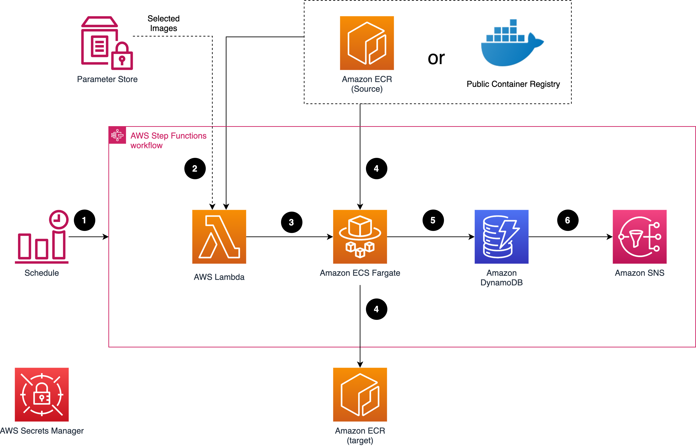

Deploying this solution with the default parameters builds the following environment in the AWS Cloud.

*Data Transfer Hub architecture*

This solution deploys the Amazon CloudFormation template in your AWS Cloud account and completes the following settings.

1.	The solution’s static web assets (frontend user interface) are stored in [Amazon S3][s3] and made available through [Amazon CloudFront][cloudfront].
2.	The backend APIs are provided via [AWS AppSync][appsync] GraphQL.
3.	Users are authenticated by either [Amazon Cognito][cognito] User Pool (in AWS Regions) or by an OpenID connect provider (in AWS China Regions) such as [Authing](https://www.authing.cn/), [Auth0](https://auth0.com/), etc.
4.	AWS AppSync runs [AWS Lambda][lambda] to call backend APIs.
5.	Lambda starts an [AWS Step Functions][stepfunction] workflow that uses [AWS CloudFormation][cloudformation] to start or stop/delete the Amazon ECR or Amazon S3 plugin template.
6.	The plugin templates are hosted in a centralized Amazon S3 bucket managed by AWS.
7.	The solution also provisions an [Amazon ECS][ecs] cluster that runs the container images used by the plugin template, and the container images are hosted in [Amazon ECR][ecr].
8.	The data transfer task information is stored in [Amazon DynamoDB][dynamodb].

After deploying the solution, you can use [AWS WAF][waf] to protect CloudFront or AppSync.

!!! note "Important"
    If you deploy this solution in AWS (Beijing) Region operated by Beijing Sinnet Technology Co., Ltd. (Sinnet), or the AWS (Ningxia) Region operated by Ningxia Western Cloud Data Technology Co., Ltd. ( ), you are required to provide a domain with ICP Recordal before you can access the web console.

The web console is a centralized place to create and manage all data transfer jobs. Each data type (for example, Amazon S3 or Amazon ECR) is a plugin for Data Transfer Hub, and is packaged as an AWS CloudFormation template hosted in an S3 bucket that AWS owns. When the you create a transfer task, an AWS Lambda function initiates the Amazon CloudFormation template, and state of each task is stored and displayed in the DynamoDB tables.

As of this revision, the solution supports two data transfer plugins: an Amazon S3 plugin and an Amazon ECR plugin. 

## Amazon S3 plugin

*Data Transfer Hub Amazon S3 plugin architecture*

The Amazon S3 plugin runs the following workflows:

1.	A time-based Event Bridge rule triggers a AWS Lambda function on an hourly basis. 
2.  AWS Lambda uses the launch template to launch a data comparison job (JobFinder) in an [Amazon Elastic Compute Cloud (Amazon EC2)][ec2].
3. The job lists all the objects in the source and destination
buckets, makes comparisons among objects and determines which objects should be transferred.
4.	Amazon EC2 sends a message for each object that will be transferred to [Amazon Simple Queue Service (Amazon SQS)][sqs]. Amazon S3 event messages can also be supported for more real-time data transfer; whenever there is object uploaded to source bucket, the event message is sent to the same Amazon SQS queue.
5.	A JobWorker running in Amazon EC2 consumes the messages in SQS and transfers the object from the source bucket to the destination bucket. You can use an Auto Scaling group to control the number of EC2 instances to transfer the data based on business need.
6.	A record with transfer status for each object is stored in Amazon DynamoDB. 
7.	The Amazon EC2 instance will get (download) the object from the source bucket based on the Amazon SQS message. 
8.	The Amazon EC2 instance will put (upload) the object to the destination bucket based on the Amazon SQS message. 
9.  When the JobWorker node identifies a large file (with a default threshold of 1 GB) for the first time, a Multipart Upload task running in Amazon EC2 is initiated. The corresponding UploadId is then conveyed to the AWS Step Functions, which invokes a scheduled recurring task. Every minute, AWS Step Functions verifies the successful transmission of the distributed shards associated with the UploadId across the entire cluster.
10. If all shards have been transmitted successfully, Amazon EC2 invokes the CompleteMultipartUpload API in Amazon S3 to finalize the consolidation of the shards. Otherwise, any invalid shards are discarded.

!!! note "Note"
    If an object (or part of an object) transfer failed, the JobWorker releases the message in the queue, and the object is transferred again after the message is visible in the queue (default visibility timeout is set to 15 minutes). If the transfer failed five times, the message is sent to the dead letter queue and a notification alarm is initiated.

## Amazon ECR plugin

*Data Transfer Hub Amazon ECR plugin architecture*

The Amazon ECR plugin runs the following workflows:

1.	An EventBridge rule runs an AWS Step Functions workflow on a regular basis (by default, it runs daily).
2.	Step Functions invokes AWS Lambda to retrieve the list of images from the source.
3.	Lambda will either list all the repository content in the source Amazon ECR, or get the stored image list from System Manager Parameter Store.
4.	The transfer task will run within Fargate in a maximum concurrency of 10. If a transfer task failed for some reason, it will automatically retry three times.
5.	Each task uses [skopeo](https://github.com/containers/skopeo) to copy the images into the target ECR.
6.	After the copy completes, the status (either success or fail) is logged into DynamoDB for tracking purpose.

[s3]:https://aws.amazon.com/s3/
[cloudfront]:https://aws.amazon.com/cloudfront/
[appsync]:https://aws.amazon.com/appsync/
[cognito]:https://aws.amazon.com/cognito/
[lambda]:https://aws.amazon.com/lambda/
[stepfunction]:https://aws.amazon.com/step-functions/
[cloudformation]:https://aws.amazon.com/cloudformation/
[ecs]:https://aws.amazon.com/ecs/
[ecr]:https://aws.amazon.com/ecr/
[dynamodb]:https://aws.amazon.com/dynamodb/
[waf]:https://aws.amazon.com/waf/
[ec2]:https://aws.amazon.com/ec2/
[sqs]:https://aws.amazon.com/sqs/