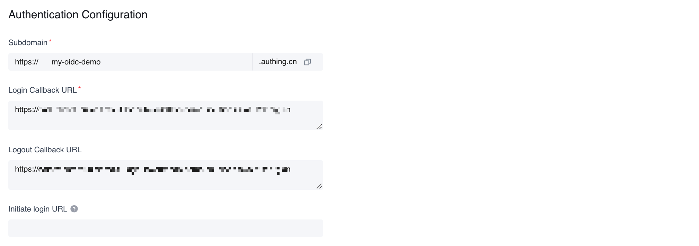
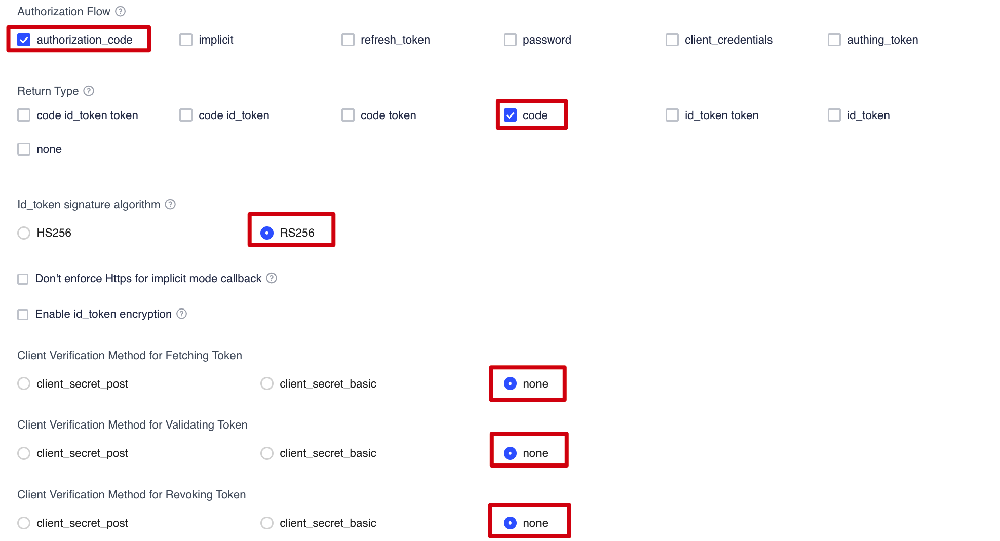
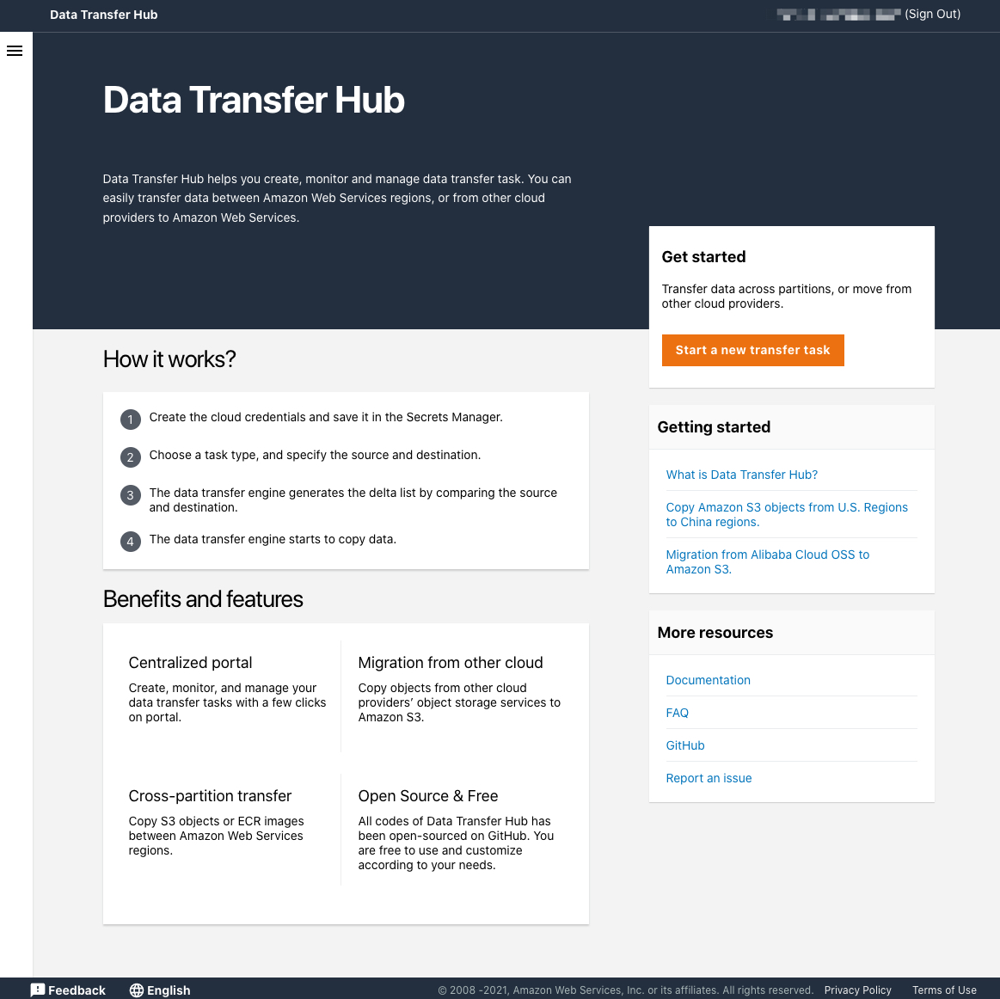

## Step 1. (Option 1) Launch the stack in AWS Regions 

!!! important "Important"
    The following deployment instructions apply to AWS Regions only. For deployment in AWS China Regions, refer to Option 2.  

**Deploy the AWS CloudFormation template for Option 1 – AWS Regions**

!!! note "Note"

    You are responsible for the cost of the AWS services used while running this solution. For more details, visit the Cost section in this guide, and refer to the pricing webpage for each AWS service used in this solution. 

1. Sign in to the AWS Management Console and select the button to launch the `DataTransferHub-cognito.template` AWS CloudFormation template. Alternatively, you can [download the template](https://s3.amazonaws.com/solutions-reference/data-transfer-hub/latest/DataTransferHub-cognito.template) as a starting point for your own implementation.

    

2.	The template launches in the US East (N. Virginia) Region by default. To launch the solution in a different AWS Region, use the Region selector in the console navigation bar. 

3.	On the **Create stack** page, verify that the correct template URL is in the **Amazon S3 URL** text box and choose **Next**.

4.	On the **Specify stack details** page, assign a name to your solution stack. For information about naming character limitations, refer to [IAM and and AWS STS quotas](https://docs.aws.amazon.com/IAM/latest/UserGuide/reference_iam-limits.html) in the *AWS Identity and Access Management User Guide*.

5.	Under **Parameters**, review the parameters for this solution template and modify them as necessary. This solution uses the following default values.

    | Parameter | Default | Description |
    |----------|--------|--------|
    | **AdminEmail** | <Requires input\> |	The email of the Admin user.

6.	Choose **Next**. 

7.	On the **Configure Stack Options** page, keep the default values and choose **Next**.

8.	On the **Review** page, review and confirm the settings. Check the box acknowledging that the template will create AWS Identity and Access Management (IAM) resources.

9.	Choose **Create stack** to deploy the stack.

You can view the status of the stack in the AWS CloudFormation console in the **Status** column. You should receive a **CREATE_COMPLETE** status in approximately 15 minutes.

## Step 1. (Option 2) Launch the stack in AWS China Regions 

!!! important "Important"

    The following deployment instructions apply to AWS China Regions only. For deployment in AWS Regions, refer to Option 1.  

### Prerequisites
1.	Create an OIDC user pool.
2.	Configure domain name service (DNS) resolution. 
3.  Make sure a domain registered by [ICP][icp] is available.

### Prerequisite 1: Create an OIDC user pool
In AWS Regions where Amazon Cognito is not yet available, you can use OIDC to provide authentication. The following procedure uses AWS Partner [Authing](https://www.authing.cn/) as an example, but you can also choose any available provider. 

1. Go to the [Authing console](https://console.authing.cn/console){target=_blank}.
2. Create a new user pool if you don't have one.
3. Select the user pool.
4. On the left navigation bar, select **Self-built App** under **Applications**. 
5. Click the **Create** button.
6. Enter the **Application Name**, and **Subdomain**.
7. Save the `App ID` (that is, `client_id`) and `Issuer` to a text file from Endpoint Information, which will be used later.
    

8. Update the `Login Callback URL` and `Logout Callback URL` to your IPC recorded domain name.
    

9. Set the Authorization Configuration.
    
10. Update login control.
    1. Select and enter the **Application** interface from the left sidebar, select **Login Control**, and then select **Registration and Login**.
    2. Please select only **Password Login: Email** for the login method.
    3. Please **uncheck** all options in the registration method.
    4. Select **Save**.

11. Create an admin user.
    1. From **Users & Roles**, select **Users**, then choose **Create user**.
    2. Enter the email for the user. 
    3. Choose **OK**. 
    4. Check the email for a temporary password. 
    5. Reset the user password.

    !!! note "Note"
        Because this solution does not support application roles, all the users will receive admin rights. 

### Prerequisite 2: Configure domain name service resolution 
Configure domain name service (DNS) resolution to point the ICP licensed domain to the CloudFront default domain name. Optionally, you can use your own DNS resolver. 

The following is an example for configuring an Amazon Route 53.

1. Create a hosted zone in Amazon Route 53. For more information, refer to the [Amazon Route 53 Developer Guide](https://docs.aws.amazon.com/Route53/latest/DeveloperGuide/Welcome.html).

2. Create a CNAME record for the console URL.

    1. From the hosted zone, choose **Create Record**.
    1. In the **Record name** input box, enter the host name.
    1. From **Record type** select **CNAME**.
    1. In the value field, enter the CloudFormation output PortalUrl. 
    1. Select **Create records**.

3. Add alternative domain names to the CloudFront distribution.

    1. Configure the corresponding domain name in CloudFront to open the CloudFront console by finding the distribution ID for PortalURL in the list and selecting **ID** (or check the check box, and then select **Distribution Settings**).
    1. Click **Edit**, and add the record of Route 53 in the previous step to the `Alternate Domain Name (CNAME)`.

**Deploy the AWS CloudFormation template for Option 2 – AWS China Regions**

This automated AWS CloudFormation template deploys Data Transfer Hub in the AWS Cloud. You must Create an ODIC User Pool and Configure DNS resolution before launching the stack.

!!! note "Note"

    You are responsible for the cost of the AWS services used while running this solution. For more details, visit the Cost section in this guide, and refer to the pricing webpage for each AWS service used in this solution. 

1. Sign in to the AWS Management Console and select the button to launch the `DataTransferHub-openid.template` AWS CloudFormation template. Alternatively, you can [download the template](https://s3.amazonaws.com/solutions-reference/data-transfer-hub/latest/DataTransferHub-openid.template) as a starting point for your own implementation. 

    

2. The template launches in your console’s default Region. To launch the solution in a different AWS Region, use the Region selector in the console navigation bar. 

3. On the **Create stack** page, verify that the correct template URL is in the Amazon S3 URL text box and choose **Next**.

4.	On the **Specify stack details** page, assign a name to your solution stack. For information about naming character limitations, refer to [IAM and AWS STS quotas](https://docs.aws.amazon.com/IAM/latest/UserGuide/reference_iam-limits.html) in the *AWS Identity and Access Management User Guide*.

5.	Under **Parameters**, review the parameters for this solution template and modify them as necessary. This solution uses the following default values.

    | Parameter | Default | Description |
    |----------|--------|--------|
    | **OidcProvider** | <Requires input\> |	Refers to the Issuer shown in the OIDC application configuration.  
    | **OidcClientId** | <Requires input\> |	Refers to the App ID shown in the OIDC application configuration. 
    | **OidcCustomerDomain** | <Requires input\> | Refers to the customer domain that has completed ICP registration in China, not the subdomain provided by Authing.   It must start with `https://`.
    | **AdminEmail** | <Requires input\> | Refers to the email for receiving task status alarm.

6. Choose **Next**.

7. On the **Configure Stack Options** page, keep the default values and choose **Next**.

8. On the **Review** page, review and confirm the settings. Check the box acknowledging that the template will create AWS Identity and Access Management (IAM) resources.

9. Choose **Create Stack** to deploy the stack. 
    
You can view the **status** of your stack in the AWS CloudFormation console in the Status column. You should receive a **CREATE_COMPLETE** status in approximately 15 minutes.

## Step 2. Launch the web console 

After the stack is successfully created, navigate to the CloudFormation **Outputs** tab and select the **PortalUrl** value to access the Data Transfer Hub web console.

After successful deployment, an email containing the temporary login password will be sent to the email address provided.

Depending on the region where you start the stack, you can choose to access the web console from the AWS China Regions or the AWS Regions.

- [Log in with Amazon Cognito User Pool (for AWS Regions)](#cognito)
- [Log in with OpenID using Authing.cn (for AWS China Regions)](#openid)

### (Option 1) Log in using Amazon Cognito user pool for AWS Regions 

1. Using a web browser, enter the **PortalURL** from the CloudFormation **Output** tab, then navigate to the Amazon Cognito console. 

2. Sign in with the **AdminEmail** and the temporary password.
    1. Set a new account password.
    2. (Optional) Verify your email address for account recovery. 
3. After the verification is complete, the system opens the Data Transfer Hub web console.

### (Option 2) OpenID authentication for AWS China Regions 
1. Using a web browser, enter the Data Transfer Hub domain name. 
    - If you are logging in for the first time, the system will open the Authing.cn login interface. 
2. Enter the username and password you registered when you deployed the solution, then choose Login. The system opens the Data Transfer Hub web console.
3. Change your password and then sign in again. 

## Step 3. Create a transfer task 

Use the web console to create a transfer task for Amazon S3 or Amazon ECR. For more information, refer to [Create Amazon S3 Transfer Task](../user-guide/tutorial-s3.md) and [Create Amazon ECR Transfer Task](../user-guide/tutorial-ecr.md).

*Data Transfer Hub web console*

[icp]: https://www.amazonaws.cn/en/support/icp/?nc2=h_l2_su