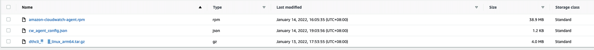

This tutorial describes how to use Data Transfer Hub (DTH) via Direct Connect (DX).

When DTH worker node and finder node start to work, they need to download related assets (such as CloudWatch agent, DTH CLI) from internet by default. In an isolated network, you need to manually download and upload these files to an S3 bucket in the region where DTH is deployed.

You have two options to use DTH to transfer data via DX:

- [Use DTH to transfer data via DX in a non-isolated network](#non-isolated-network)
- [Use DTH to transfer data via DX in an isolated network](#isolated-network)

## Use DTH to transfer data via DX in a non-isolated network <a name="non-isolated-network"></a>
In this scenario, DTH is deployed in the **destination side** and within a VPC with **public access** (has Internet Gateway or NAT), and the source bucket is in the isolated network.

!!! note "Note"

    As DTH deployment VPC has public internet access (IGW or NAT), EC2 worker/finder nodes can access other AWS services used by DTH such as secret managers and download related assets (such as CloudWatch agent, DTH CLI) from internet without any changes.

1. From the **Create Transfer Task** page, select **Create New Task**, and then select **Next**.

2. From the **Engine options** page, under engine, select **Amazon S3**, and then choose **Next Step**.

3. Specify the transfer task details.
    - Under **Source Type**, select the data source **Amazon S3 Compatible Storage**. 

4. Enter **endpoint url**, which must be the **interface endpoint** url, such as `https://bucket.vpce-076205013d3a9a2ca-us23z2ze.s3.ap-east-1.vpce.amazonaws.com`. You can find the specific url in [VPC Endpoint Console](https://us-east-1.console.aws.amazon.com/vpc/home?region=us-west-2#Endpoints:vpcEndpointType=Interface) DNS names part.

5. Enter **bucket name** and choose to sync **Full Bucket** or **Objects with a specific prefix** or **Objects with different prefixes**.

6. Provide destination settings for the S3 buckets. 

7. From **Engine settings**, verify the values and modify them if necessary. For incremental data transfer, we recommend to set the **minimum capacity** to at least 1.

8. At **Task Scheduling Settings**, select your task scheduling configuration.
     - If you want to configure the timed task at a fixed frequency to compare the data difference on both sides of the time, select **Fixed Rate**.
     - If you want to configure a scheduled task through [Cron Expression](https://docs.aws.amazon.com/AmazonCloudWatch/latest/events/ScheduledEvents.html#CronExpressions) to achieve a scheduled comparison of data differences on both sides, select **Cron Expression**.
     - If you only want to perform the data synchronization task once, select **One Time Transfer**.

9. For **Advanced Options**, keep the default values.

10. At **Need Data Comparison before Transfer**, select your task configuration.

    - If you want to skip the data comparison process and transfer all files, select **No**.
    - If you only want to synchronize files with differences, select **Yes**.

11. In **Alarm Email**, provide an email address.

12. Choose **Next** and review your task parameter details. 

13. Choose **Create Task**. 

## Use DTH to transfer data via DX in an isolated network <a name="isolated-network"></a>
In this scenario, DTH is deployed in the **destination side** and within a VPC **without public access** (isolated VPC), and the source bucket is also in an isolated network.

### Prerequisites
**Configure the service endpoints for VPC**

DTH worker/finder nodes need to access other AWS services. To do so, you need to create **Gateway Endpoint** for **DynamoDB** and **S3**, create **Interface Endpoint** for **logs**, **SQS** and **Secret Managers**.


**Upload the artifacts to an S3 bucket**

In an isolated network, do the following to manually download and upload files to an S3 bucket in the region where DTH is deployed.

1. Download [Amazon CloudWatch Agent](https://s3.amazonaws.com/amazoncloudwatch-agent/amazon_linux/arm64/latest/amazon-cloudwatch-agent.rpm) and [DTH CLI](https://aws-gcr-solutions.s3.amazonaws.com/data-transfer-hub-s3/latest/drhcli_1.0.1_linux_arm64.tar.gz).

2. Create the worker's CloudWatch Agent Config file. You can create a file named `cw_agent_config.json`.
```json
{
    "agent": {
        "metrics_collection_interval": 60,
        "run_as_user": "root"
    },
    "logs": {
        "logs_collected": {
            "files": {
                "collect_list": [
                    {
                        "file_path": "/home/ec2-user/worker.log",
                        "log_group_name": "##log group##",
                        "log_stream_name": "Instance-{instance_id}"
                    }
                ]
            }
        }
    },
    "metrics": {
        "append_dimensions": {
            "AutoScalingGroupName": "${aws:AutoScalingGroupName}",
            "InstanceId": "${aws:InstanceId}"
        },
        "aggregation_dimensions": [
            [
                "AutoScalingGroupName"
            ]
        ],
        "metrics_collected": {
            "disk": {
                "measurement": [
                    "used_percent"
                ],
                "metrics_collection_interval": 60,
                "resources": [
                    "*"
                ]
            },
            "mem": {
                "measurement": [
                    "mem_used_percent"
                ],
                "metrics_collection_interval": 60
            }
        }
    }
}
```
3. Upload these three files to an S3 bucket in the region where DTH is deployed.



### Deploy the DTH S3-Plugin

We recommend using the **DTH S3-plugin** to create the transfer task, instead of using the DTH console.

**For AWS China Regions**

[](https://console.amazonaws.cn/cloudformation/home#/stacks/create/template?stackName=DTHS3Stack&templateURL=https://aws-gcr-solutions.s3.cn-north-1.amazonaws.com.cn/data-transfer-hub-s3/latest/DataTransferS3Stack-ec2.template)

**For AWS Global Regions**

[](https://console.aws.amazon.com/cloudformation/home#/stacks/create/template?stackName=DTHS3Stack&templateURL=https://aws-gcr-solutions.s3.amazonaws.com/data-transfer-hub-s3/latest/DataTransferS3Stack-ec2.template)
    
1. For **Source Type**, choose **Amazon_S3**.

2. Enter the **Source Bucket** name.

3. Enter the **Source Prefix** if needed.

4. Enter the **Source Endpoint URL**. For example, `https://bucket.vpce-076205013d3a9a2ca-us23z2ze.s3.ap-east-1.vpce.amazonaws.com`.

5. For **Source In Current Account**, choose **false**.

6. For **Source Credentials**, enter the secret's name stored in the [Secrets Manager](https://console.aws.amazon.com/secretsmanager/home).

7. For **Enable S3 Event**, choose **No**.

8. Configure the **Destination Bucket**, **Destination Prefix**, **Destination Region** and **Destination in Current Account**. Leave the Destination Credentials blank if the destination bucket is in current account.

9. Configure the **Alarm Email**.

10. Configure the **VPC ID** and **Subnet IDs**.

11. For other parameters, keep the default values and choose **Next**.

12. Choose **Next**. Configure additional stack options such as tags (Optional). 

13. Choose **Next**. Review and confirm acknowledgement, then choose **Create Stack** to start the deployment.

The deployment will take approximately 3 to 5 minutes.

### Update the EC2 Userdata for worker nodes and finder node

**Update worker nodes' Userdata**

1. Go to the Auto Scaling Group's [Launch configurations](https://us-west-2.console.aws.amazon.com/ec2/v2/home?region=us-west-2#LaunchConfigurations:launchConfigurationName=).

2. Select the configuration and choose **Copy Launch Configuration**.

3. Edit the **User data** under the **Advanced details** section.
    - Replace the code above `echo "export JOB_TABLE_NAME=xxxxxxxxxxx" >> env.sh` with the following shell script.


    ```shell
    #!/bin/bash

    yum update -y
    cd /home/ec2-user/
    asset_bucket=<asset_bucket_name>
    aws s3 cp "s3://$asset_bucket/cw_agent_config.json" . --region <deploy_region_name>
    aws s3 cp "s3://$asset_bucket/amazon-cloudwatch-agent.rpm" .  --region <deploy_region_name>
    aws s3 cp "s3://$asset_bucket/dthcli_1.0.1_linux_arm64.tar.gz" .  --region <deploy_region_name>

    sudo yum install -y amazon-cloudwatch-agent.rpm
    sed -i  -e "s/##log group##/<worker_log_group_name>/g" cw_agent_config.json
    /opt/aws/amazon-cloudwatch-agent/bin/amazon-cloudwatch-agent-ctl -a fetch-config -m ec2 -c file:/home/ec2-user/cw_agent_config.json -s
    tar zxvf dthcli_1.0.1_linux_arm64.tar.gz

    ```

    - Replace the `<asset_bucket_name>` with your specific bucket name where the assets are stored. 
    
    - Replace the `<deploy_region_name>` with the region where you deploy the DTH S3-Plugin solution.
    
    - Replace the `<worker_log_group_name>` with the DTH Worker's log group name.

    - Do not edit the code behind `echo "export JOB_TABLE_NAME=xxxxxxxxxxx" >> env.sh`.

4. Choose **Create Launch Configuration**.

5. Go to [Auto Scaling Group](https://us-west-2.console.aws.amazon.com/ec2/v2/home?region=us-west-2#AutoScalingGroups:).

6. Choose the specific scaling group and click **Edit**.

7. In the **Launch configuration** section, choose the new launch configuration created in the previous step. Click **Update**.

8. Terminate all the running DTH worker node, and the Auto Scaling Group will launch the new worker node with the new Userdata.

**Update finder nodes' Userdata**

1. Go to the EC2 [Launch Templates](https://us-west-2.console.aws.amazon.com/ec2/v2/home?region=us-west-2#LaunchTemplates:).

2. Click **Modify template**.

3. Edit the **User data** under the **Advanced details** section.
    - Replace the code above `echo "export JOB_TABLE_NAME=xxxxxxxxxxx" >> env.sh` using the shell script bellow.

    ```shell
    #!/bin/bash

    yum update -y
    cd /home/ec2-user/
    asset_bucket=<asset_bucket_name>
    aws s3 cp "s3://$asset_bucket/amazon-cloudwatch-agent.rpm" .  --region <deploy_region_name>
    aws s3 cp "s3://$asset_bucket/dthcli_1.0.1_linux_arm64.tar.gz" .  --region <deploy_region_name>

    echo "{\"agent\": {\"metrics_collection_interval\": 60,\"run_as_user\": \"root\"},\"logs\": {\"logs_collected\": {\"files\": {\"collect_list\": [{\"file_path\": \"/home/ec2-user/finder.log\",\"log_group_name\": \"##log group##\"}]}}}}" >> /home/ec2-user/cw_agent_config.json,

    sudo yum install -y amazon-cloudwatch-agent.rpm

    sed -i  -e "s/##log group##/<finder_log_group_name>`/g" cw_agent_config.json
    /opt/aws/amazon-cloudwatch-agent/bin/amazon-cloudwatch-agent-ctl -a fetch-config -m ec2 -c file:/home/ec2-user/cw_agent_config.json -s
    tar zxvf dthcli_1.0.1_linux_arm64.tar.gz
    
    ```

    - Replace the `<asset_bucket_name>` with your specific bucket name where the assets are stored. 

    - Replace the `<deploy_region_name>` with the region where you deploy the DTH S3-Plugin solution.

    - Replace the `<finder_log_group_name>` with the DTH Finder's log group name.

    - Do not edit the code behind `echo "export JOB_TABLE_NAME=xxxxxxxxxxx" >> env.sh`.

4. Choose **Create template version**.

5. Use this new version template to launch a new Finder Node, and manually terminate the old one.


## Architecture

[![architecture]][architecture]

[architecture]: ./images/dx-arch-global.png

DTH worker nodes running on EC2 transfer data from bucket in one AWS account to bucket in another AWS account.

* To access bucket in the account where DTH is deployed, DTH worker nodes use **S3 Gateway Endpoint**
* To access bucket in another account, DTH worker nodes use **S3 Private Link** by **S3 Interface Endpoint**