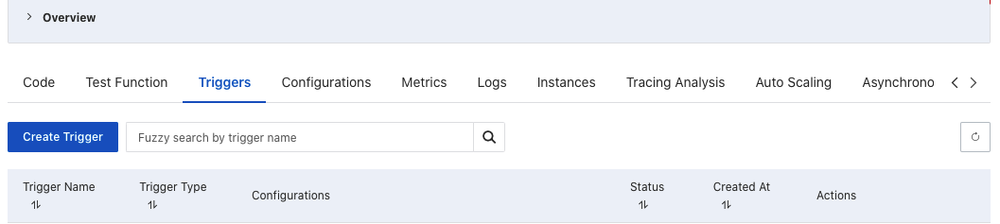

This tutorial describes how to transfer Objects from **Alibaba Cloud OSS** to **Amazon S3**. 

## Prerequisite
You have already deployed the Data Transfer Hub in **Oregon (us-west-2)** region. For more information, see [deployment](./deployment.md).

## Step 1: Configure credentials for OSS
1. Open the **[Secrets Manager](https://console.aws.amazon.com/secretsmanager/home#)** console.
1. Choose **Secrets** in the left navigation bar.
1. Click **Store a new secret** button.
1. Select **Other type of secrets**.
1. Enter the **credentials of Alibaba Cloud** as text in **Plaintext**. The credentials are in the format of:

    ```
    {
        "access_key_id": "<Your Access Key ID>",
        "secret_access_key": "<Your Access Key Secret>"
    }
    ```

1. Click **Next**.
1. Enter **Secret name**. For example, `dth-oss-credentials`.
1. Click **Next**.
1. Select **Disable automatic rotation**.
1. Click **Store**.

## Step 2: Create an OSS transfer task
1. From the **Create Transfer Task** page, select **Create New Task**, and then select **Next**.

2. From the **Engine options** page, under engine, select **Amazon S3**, and then choose **Next Step**.

3. Specify the transfer task details.
    - Under **Source Type**, select the data source **Aliyun OSS**. 

4. Enter **bucket name** and choose to sync **Full Bucket** or **Objects with a specific prefix** or **Objects with different prefixes**.

5. Provide destination settings for the S3 buckets. 

6. From **Engine settings**, verify the values and modify them if necessary. For incremental data transfer, we recommend to set the **minimum capacity** to at least 1.

7. At **Task Scheduling Settings**, select your task scheduling configuration.
     - If you want to configure the timed task at a fixed frequency to compare the data difference on both sides of the time, select **Fixed Rate**.
     - If you want to configure a scheduled task through [Cron Expression](https://docs.aws.amazon.com/AmazonCloudWatch/latest/events/ScheduledEvents.html#CronExpressions) to achieve a scheduled comparison of data differences on both sides, select **Cron Expression**.
     - If you only want to perform the data synchronization task once, select **One Time Transfer**.
    - If you need to achieve real-time incremental data synchronization, please refer to the [event config guide](#oss-event).

8. For **Advanced Options**, keep the default values.

9. At **Need Data Comparison before Transfer**, select your task configuration.
     -If you want to skip the data comparison process and transfer all files, select **No**.
     -If you only want to synchronize files with differences, select **Yes**.

10. Enter an email address in **Alarm Email**.

11. Choose **Next** and review your task parameter details. 

12. Choose **Create Task**. 

After the task is created successfully, it will appear on the **Tasks** page.


Figure 2: Transfer task details and status

Select the **Task ID** to go to the task Details page, and then choose **CloudWatch Dashboard** to monitor the task status.

### How to achieve real-time data transfer by OSS event trigger <a name="oss-event"></a>

If you want to achieve real-time data transfer from Alibaba Cloud OSS to Amazon S3, follow this section to enable **OSS event** trigger. 

After you created the task, go to [SQS console](https://us-west-2.console.aws.amazon.com/sqs/v2/home?region=us-west-2#/queues) and record the `Queue URL` and `Queue arn` that will be used later. 

**Prepare your AWS account's Access Key/Secret Key**

1. Go to [IAM console](https://us-east-1.console.aws.amazon.com/iam/home#/policies$new?step=edit), and click **Create Policy**. 

2. Choose the **JSON** tab, and enter the following information.

    ```json
    {
        "Version": "2012-10-17",
        "Statement": [
            {
                "Effect": "Allow",
                "Action": [
                    "sqs:SendMessageBatch",
                    "sqs:SendMessage"
                ],
                "Resource": "arn:aws:sqs:us-west-2:xxxxxxxxxxx:DTHS3Stack-S3TransferQueue-1TSF4ESFQEFKJ"
            }
        ]
    }
    ```
    !!! Note "Note"
        Replace your Queue arn in the JSON.

3. Create the user. Go to the [User](https://console.aws.amazon.com/iam/home?region=us-west-2#/users) console and click **Add User**. 

4. Attach the policy you created previously to the user.  

5. Save the **ACCESS_KEY/SECRET_KEY** which will be used later.

**Prepare the event-sender function for Alibaba Cloud**

1. Open the terminal and enter the following command. You can use docker or Linux machine.
    ```shell
    mkdir tmp
    cd tmp
    pip3 install -t . boto3
    ```

2. Create a `index.py` in the same folder, and enter the code below.

    ```python
    import json
    import logging
    import os
    import boto3


    def handler(event, context):
        logger = logging.getLogger()
        logger.setLevel('INFO')
        evt = json.loads(event)
        if 'events' in evt and len(evt['events']) == 1:
            evt = evt['events'][0]
            logger.info('Got event {}'.format(evt['eventName']))
            obj = evt['oss']['object']
            # logger.info(obj)
            ak = os.environ['ACCESS_KEY']
            sk = os.environ['SECRET_KEY']
            queue_url = os.environ['QUEUE_URL']
            region_name = os.environ['REGION_NAME']
            # minimum info of a message
            obj_msg = {
                'key': obj['key'],
                'size': obj['size']
            }
            # start sending the msg
            sqs = boto3.client('sqs', region_name=region_name,
                            aws_access_key_id=ak, aws_secret_access_key=sk)
            try:
                sqs.send_message(
                    QueueUrl=queue_url,
                    MessageBody=json.dumps(obj_msg)
                )
            except Exception as e:
                logger.error(
                    'Unable to send the message to Amazon SQS, Exception:', e)
        else:
            logger.warning('Unknown Message '+evt)

        return 'Done'
    ```

3. Zip the code (including boto3).

    ```shell
    zip -r code.zip *
    ```

**Create a function in Alibaba Cloud**

1. Use your Alibaba Cloud account to log in to [Function Compute](https://fc.console.aliyun.com/fc/tasks/), and click **Task**.

2. Click **Create Function**.

3. Choose **Python3.x** as the **Runtime Environments**.

4. In **Code Upload Method**, choose **Upload ZIP**.

5. Upload the `code.zip` created in the previous step to create the function.

6. Click **Create**.

**Configure the function's environment variables**

1. Click the **Configurations**.

2. Click **Modify** in the **Environment Variables**.

3. Enter the config json in the **Environment Variables**. Here you need to use your own `ACCESS_KEY`, `SECRET_KEY` and `QUEUE_URL`.

    ```json
    {
        "ACCESS_KEY": "XXX",
        "QUEUE_URL": "https://sqs.us-west-2.amazonaws.com/xxxx/DTHS3Stack-S3TransferQueue-xxxx",
        "REGION_NAME": "us-west-2",
        "SECRET_KEY": "XXXXX"
    }
    ```
4. Click **OK**.

### Create the trigger

1. Click the **Create Trigger** in **Triggers** tab to create the trigger for the function.

    

2. Choose **OSS** as the **Trigger Type**, choose the bucket name.

3. For **Trigger Event**, choose:

    ```
    oss:ObjectCreated:PutObject
    oss:ObjectCreated:PostObject 
    oss:ObjectCreated:CopyObject
    oss:ObjectCreated:CompleteMultipartUpload
    oss:ObjectCreated:AppendObject
    ```

4. Click **OK**.