## 使用Authing作为认证方式部署Data Transfer Hub

本文介绍的是使用Authing作为认证方式部署Data Transfer Hub

### 注册Authing

如果您已经有了Authing的账号，请移至下一步

访问 [https://console.authing.cn/register](https://console.authing.cn/register) 注册账号

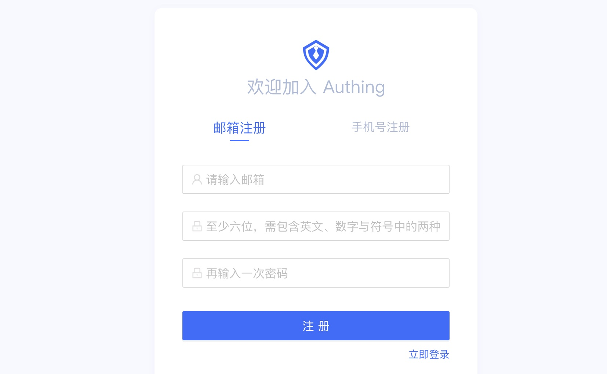

### 在Authing中创建用户池

账号创建成功后，登录Authing控制台。

在首次登录的时候，需要创建一个用户池

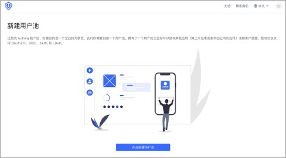

在弹出的用户池创建窗口中，输入用户池名称，点击 **确认** 按钮

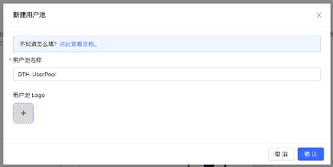

### 在Authing中创建并配置OIDC应用

在菜单栏中点击应用，在应用界面中点击右上角的 **创建应用** 按钮，选择自建应用

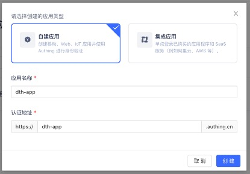

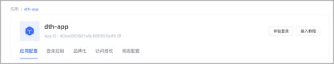

在创建应用表单中，依次输入应用名称以及认证地址，点击 **创建** 按钮。
#### 配置OIDC应用

在基础设置中，确保默认协议类型为OIDC，点击右方的 **保存** 按钮。

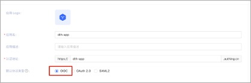

在URL设置中，设置回调URL为https://您部署DataTransferHub的域名/authentication/callback，点击右方的 **保存** 按钮。

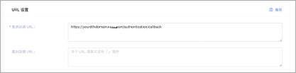

在授权配置中，授权模式选择implicit，返回类型选择id_token，点击右方的 **保存** 按钮。

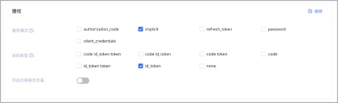

修改登录控制配置，点击登录控制标签页，在登录注册方式中，登录方式默认只允许邮箱登录，注册方式全部取消勾选（停用用户注册功能），点击右方的 **保存** 按钮。

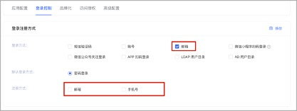

修改id_token认证签名算法，在高级设置标签页中，安全性的id_token签名算法修改为RS256，点击右方的 **保存** 按钮。

#### 创建Data Transfer Hub登录用户

在上述步骤中，我们禁用了用户注册功能，在此我们需要手动为Data Transfer Hub创建登录用户。

依次点击左边菜单中的用户管理，用户列表进入到用户列表管理页面。

点击**创建用户**按钮

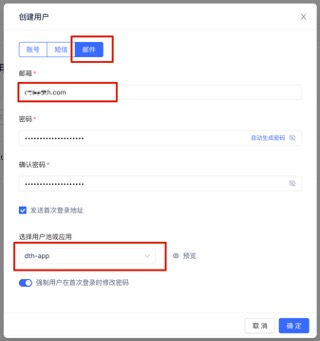

在弹出的创建用户对话框中，选择邮件标签页，填写邮箱地址，密码，以及在选择用户池或应用选项中，选择我们刚创建的Data Transfer Hub的应用。点击**确定**。

注：用户会收到一封来自Authing的含有临时密码的邮件，用户首次登录的时候强制需要修改密码。

### 在Cloudformation中部署Data Transfer Hub

在部署之前，请将Authing应用配置中的 **APP ID** 和 **Issuer** 记录下来，在部署的时候，需要将这两个值填入Cloudformation的部署参数中。

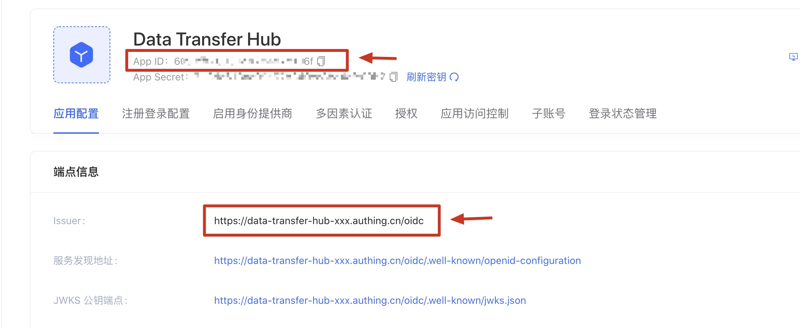

#### 使用 Cloudformation 一键部署 Data Transfer Hub

1. 确保您已经登录到AWS控制台.

    [中国区](https://console.amazonaws.cn/console/home)

    [海外区](https://console.aws.amazon.com/console/home)

2. 单击以下按钮以在您的AWS帐户中启动CloudFormation堆栈.

    中国区

    

    海外区

    

3. 点击 **下一步**

4. 将上面在Authing中记录的 **APP ID** 和 **Issuer** 并打开应用配置信息按照下图所示填写在Cloudformation中的OIDC Settings中的参数:

  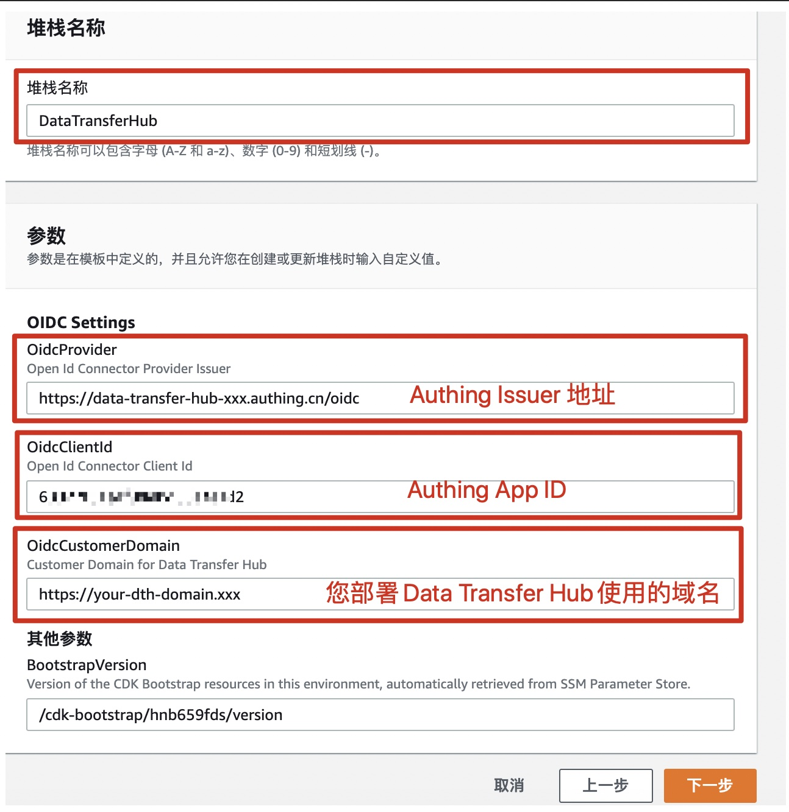
   
5. 点击 **下一步** 保持默认值然后点击 **下一步** 然后点击 **创建堆栈**.

  

至此，在Cloudformation中使用Authing作为用户认证服务部署Data Transfer Hub已经完成。

### 在Route53中配置域名指向CloudFront

在Route 53和ClouFront中，将Route53中的域名增加解析到CloudFront，并在CloudFront中备用域名 (CNAMEs)

1. 在 **Cloudformation** 的输出中找到PortalUrl

   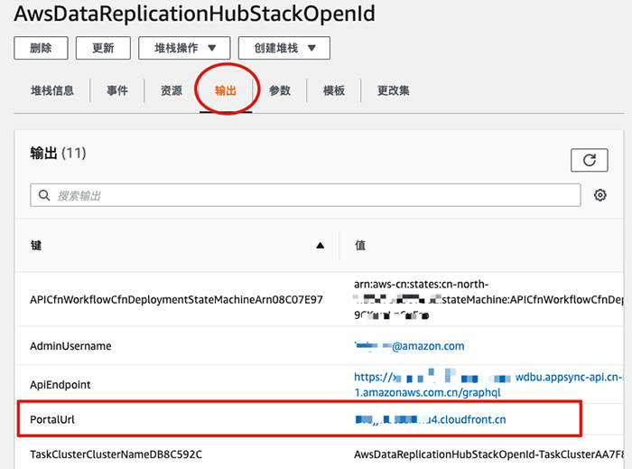

2. 在 **CloudFront** 中配置您已备案的域名

   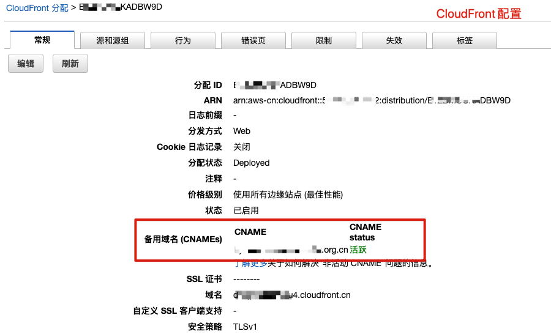

3. 在 **Route 53** 中将您的域名指向CloudFront

   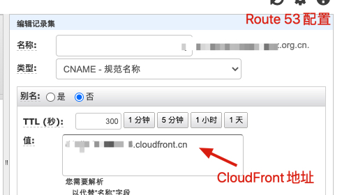

### 登录Data Transfer Hub

在浏览器中输入您配置的Data Transfer Hub的域名，将会跳转到Data Transfer Hub的登录页面，输入您在部署解决方案时创建的用户名和密码，点击登录。

  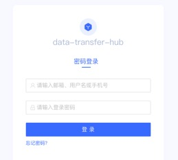

