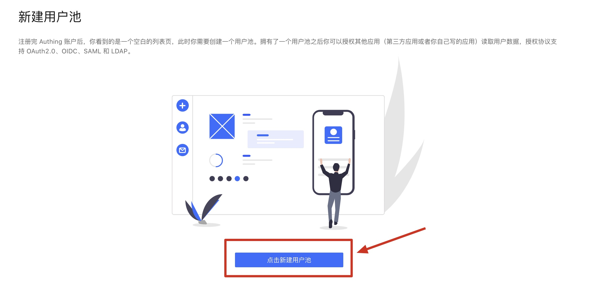
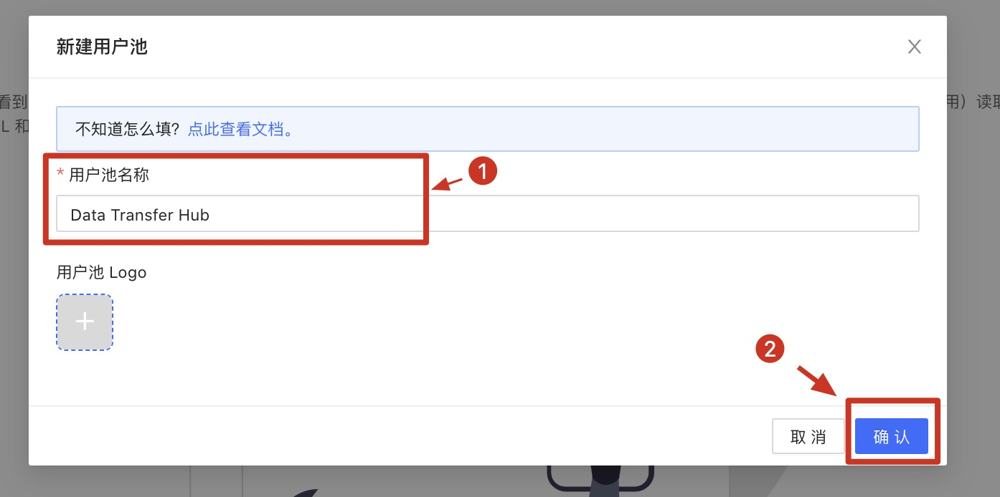
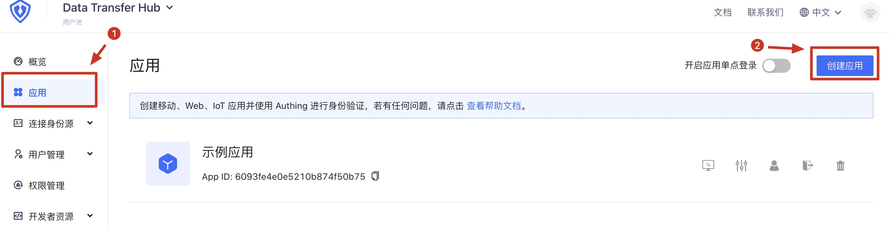
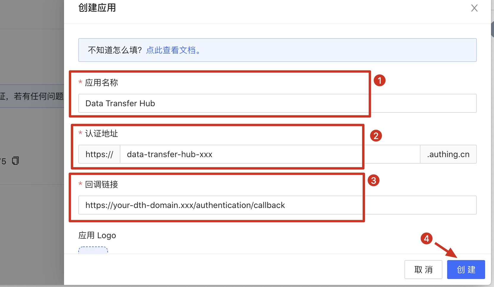
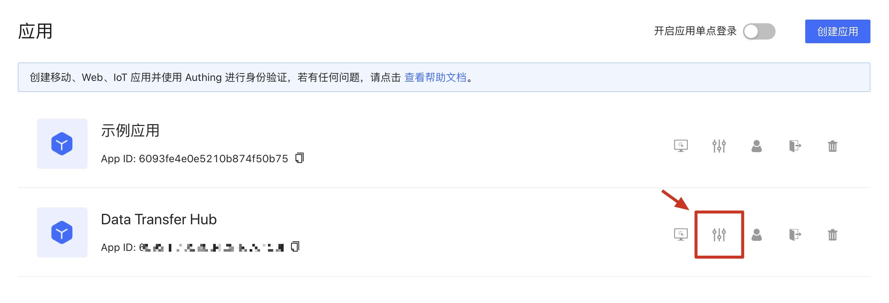
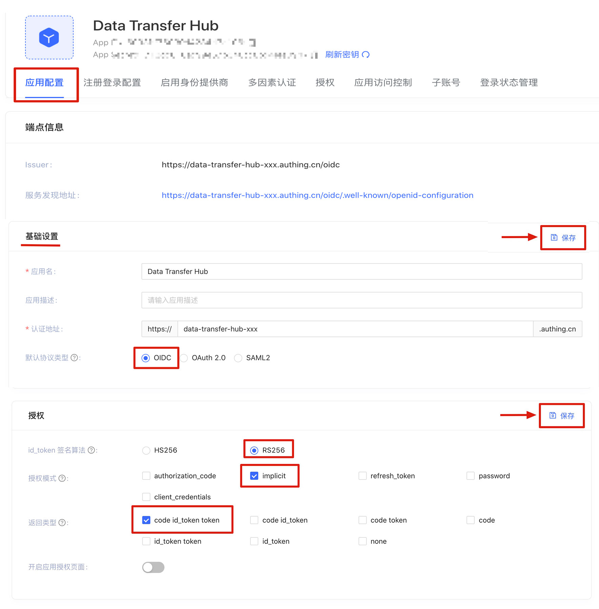
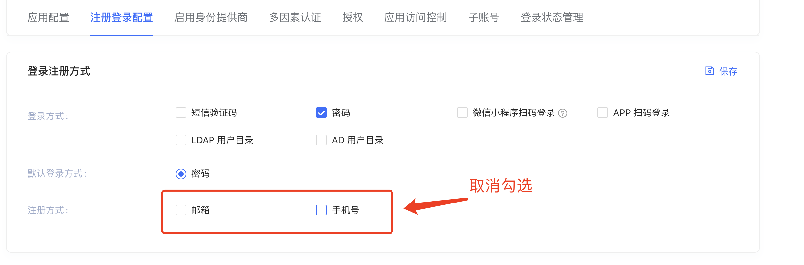

## 使用Authing作为认证方式部署Data Transfer Hub

本文介绍的是使用Authing作为认证方式部署Data Transfer Hub

### 注册Authing

如果您已经有了Authing的账号，请移至下一步

访问 [https://console.authing.cn/register](https://console.authing.cn/register) 注册账号

### 在Authing中创建OpenId应用

注册成功后，登录Authing并按照说明创建用户池。

在弹出的用户池创建窗口中，输入用户池名称，点击 **确认** 按钮

将会跳转到Dashboard页面，在左边菜单栏中点击应用，在应用界面中点击右上角的 **创建应用** 按钮

在创建应用表单中，依次输入应用名称，认证地址以及回调链接 您部署Data Transfer Hub的域名/authentication/callback，点击 **创建** 按钮。

### 在Authing中配置OpenId应用

在应用列表中，点击刚创建的应用右边的 **配置** 按钮，进入应用配置界面

在应用配置Tab页面中，基础设置部分的 默认协议类型 选择 OIDC，修改完成后点击右方的保存按钮。在授权设置部分中，id_token的签名算法设置为 RS256，授权模式修改为 Implicit, 返回类型修改为code id_token token。点击右方的 **保存** 按钮。

### 在Cloudformation中部署Data Transfer Hub

在部署之前，请将Authing应用配置中的 **APP ID** 和 **Issuer** 记录下来，在部署的时候，需要将这两个值填入Cloudformation的部署参数中。

#### 使用 Cloudformation 一键部署 Data Transfer Hub

1. 确保您已经登陆到AWS控制台.

    [中国区](https://console.amazonaws.cn/console/home)

    [海外区](https://console.aws.amazon.com/console/home)

2. 单击以下按钮以在您的AWS帐户中启动CloudFormation堆栈.

    中国区

    

    海外区

    

3. 点击 **下一步**

4. 将上面在Authing中记录的 **APP ID** 和 **Issuer** 并打开应用配置信息按照下图所示填写在Cloudformation中的OIDC Settings中的参数:

  
   
5. 点击 **下一步** 保持默认值然后点击 **下一步** 然后点击 **创建堆栈**.

  

至此，在Cloudformation中使用Authing作为用户认证服务部署Data Transfer Hub已经完成。

### 在Route53中配置域名指向CloudFront

在Route 53和ClouFront中，将Route53中的域名增加解析到CloudFront，并在CloudFront中备用域名 (CNAMEs)

1. 在 **Cloudformation** 的输出中找到PortalUrl

   

2. 在 **CloudFront** 中配置您已备案的域名

   

3. 在 **Route 53** 中将您的域名指向CloudFront

   

### 登录Data Transfer Hub

在浏览器中输入您配置的Data Transfer Hub的域名，系统会跳转到Authing的认证登录界面，首次登录系统可以注册账号

  

注册成功后，就可以使用该账号登陆Data Transfer Hub了.

### 特别注意

如果没有特别需要，建议在首次登录成功后，在Authing的应用控制台将注册功能关闭，以免产生不必要的注册用户

  

