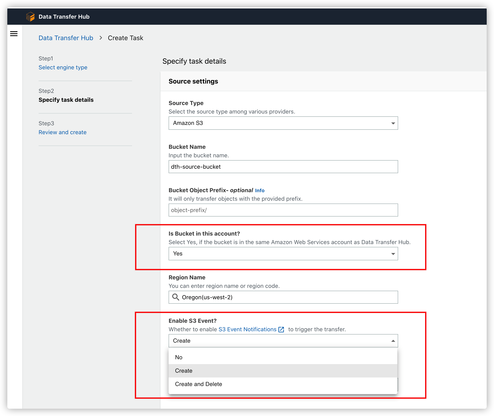
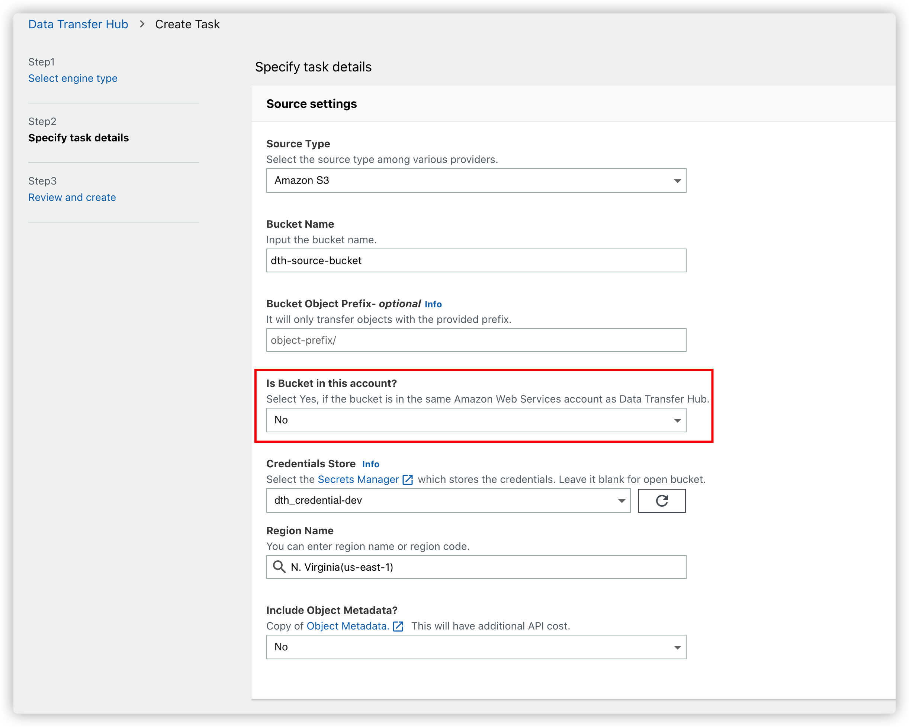
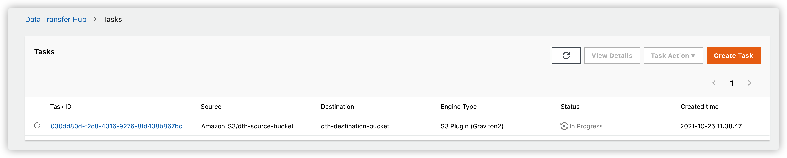

# Config S3 Event Notification to Trigger Replication Job

This tutorial is the guide to config the S3 Event to trigger Replication Jobs.

## Solution Deployed in Source Bucket Account

This Solution supports S3 Event notification to trigger the data transfer (near real-time), only if the source bucket is in the same account (and region) as the one you deploy this Solution to.

- Choose `Yes` in **Is Bucket in this account?**

- Choose `Create` or `Create and Delete` in **Enable S3 Event?**



## Solution Not Deployed in Source Bucket Account

If the Solution is deployed in the different account as the source bucket, Please refer to the following tutorial for configuration.

> Note: The Solution must be deployed in the **same region** as the source S3 bucket.

### Step1. Create a Task in Data Transfer Hub UI Console

- Choose `No` in **Is Bucket in this account?** of **Source Settings**



- Create the Replication Task and find the SQS of this Task.




### Step2. Edit the SQS Access Policy

- Select the SQS and Edit the **Access policy**


- Replace the `YOUR_DATA_TRANSFER_HUB_SQS_ARN`, `YOUR_SOURCE_BUCKET_ACCOUNT`, `YOUR_SOURCE_BUCKET_NAME`.

- Replace the original with the following permissions

```json
{
  "Version": "2012-10-17",
  "Id": "__default_policy_ID",
  "Statement": [
    {
      "Sid": "example-statement-ID",
      "Effect": "Allow",
      "Principal": {
        "Service": "s3.amazonaws.com"
      },
      "Action": "SQS:SendMessage",
      "Resource": "YOUR_DATA_TRANSFER_HUB_SQS_ARN",
      "Condition": {
        "StringEquals": {
          "aws:SourceAccount": "YOUR_SOURCE_BUCKET_ACCOUNT"
        },
        "ArnLike": {
          "aws:SourceArn": "arn:aws:s3:*:*:YOUR_SOURCE_BUCKET_NAME"
        }
      }
    }
  ]
}
```

### Step3. Create the S3 Event Notification

- Copy the SQS ARN of the Data Transfer Hub Replication Task

- Go to the source bucket account, and Create the S3 bucket event notification.


- Click **Save changes**

