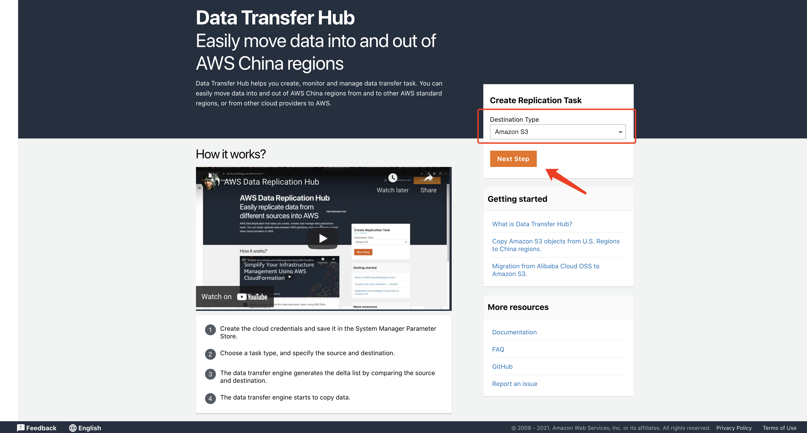
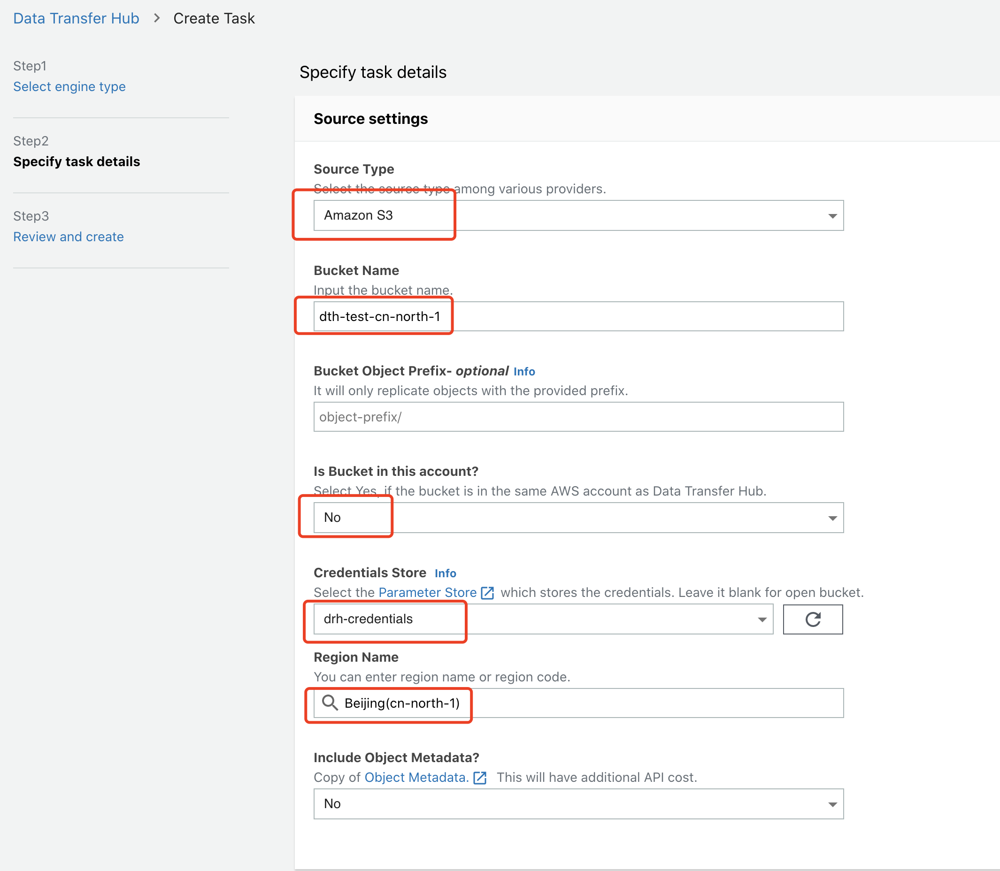

# 将Amazon S3 的数据从北京 (cn-north-1) 传输到 俄勒冈州(us-west-2)

本教程是将Amazon S3中存储的数据从 **北京（cn-north-1）** 传输到 **俄勒冈州（us-west-2）** 的指南。

我们假设您已经完成了Data Transfer Hub解决方案的部署。 并将解决方案部署在 **俄勒冈州（us-west-2）** 区域。

您可以预先参考[部署指南](../README.md)部署该解决方案.

## 登陆到 Data Transfer Hub 界面
成功创建cloudformation堆栈后，您将收到一封电子邮件通知，其中包含用于登录的临时密码，用户名是您启动cloudformation时设置的AdminEmail。

界面的网址可在cloudformation堆栈的输出选项中找到，请参见以下屏幕截图：


### 登陆界面

1. 在浏览器中输入界面的URL
2. 使用您的用户名和临时密码登录
3. 更改临时密码
4. 验证电子邮件（可选）


## 配置凭证
1. 打开 **[Systems Manager](https://us-west-2.console.aws.amazon.com/systems-manager/home?region=us-west-2#)** 控制台

2. 点击左侧边栏的 **Parameter Store** 
3. 点击 **Create parameter** 按钮

4. 输入参数名称 **Name**, 例如: `drh-credentials`
5. 在参数类型上，选择 **SecureString**
6. 在 **Value**部分输入您的中国区账户的AKSK, 该凭证需要按以下的格式
```
{
  "access_key_id": "<Your Access Key ID>",
  "secret_access_key": "<Your Access Key Secret>"
}
```


## 在网页界面中创建数据迁移任务
1. 回到 Data Transfer Hub 网页界面, 选择Amazon S3 然后点击 **Next Step**.


2. 在选择引擎类型时，我们建议选择 `EC2 Graviton 2`, 然后点击 **Next Step**.


3. 在 **数据源配置（Source settings）** 部分, 输入源数据桶的桶名以及相关参数信息. 


4. 在 **目的地配置（Destination settings）** 部分, 输入目的地数据桶的名称以及相关参数信息.


5. 输入告警邮箱然后点击 **下一步（Next Step）**


6. 在检查完任务配置后，点击 **创建任务（Create Task）**. 随后，您将看到您所创建的任务.


## 通过Cloudwatch 面板进行监控

点击任务下对应的CloudWatch链接，打开CloudWatch 面板对任务的相关数据进行监控。

注意，任务第一次启动时，面板的监控指标数据可能会有5分钟左右的延迟。

