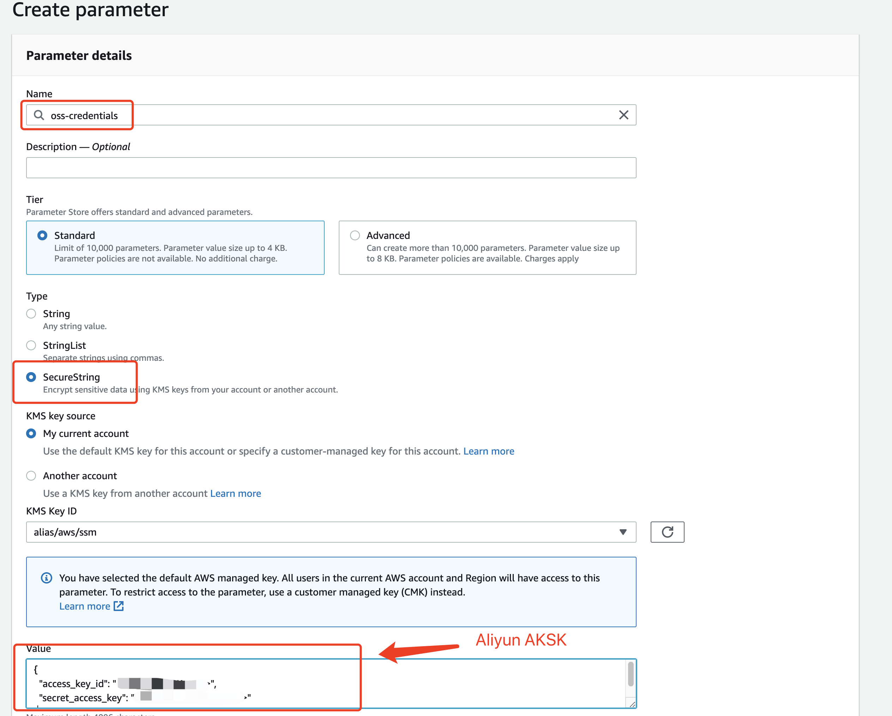
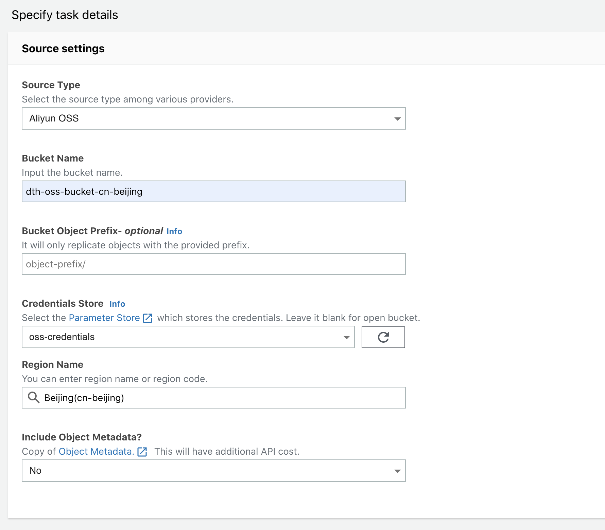
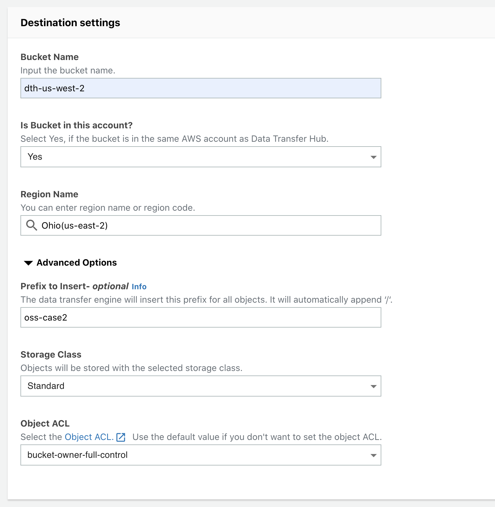
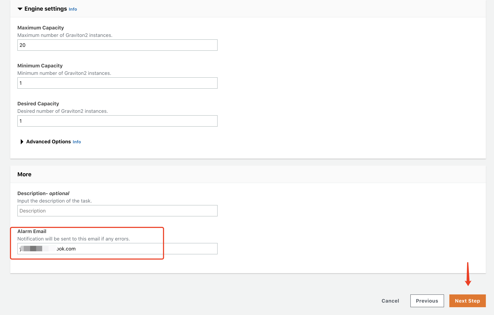
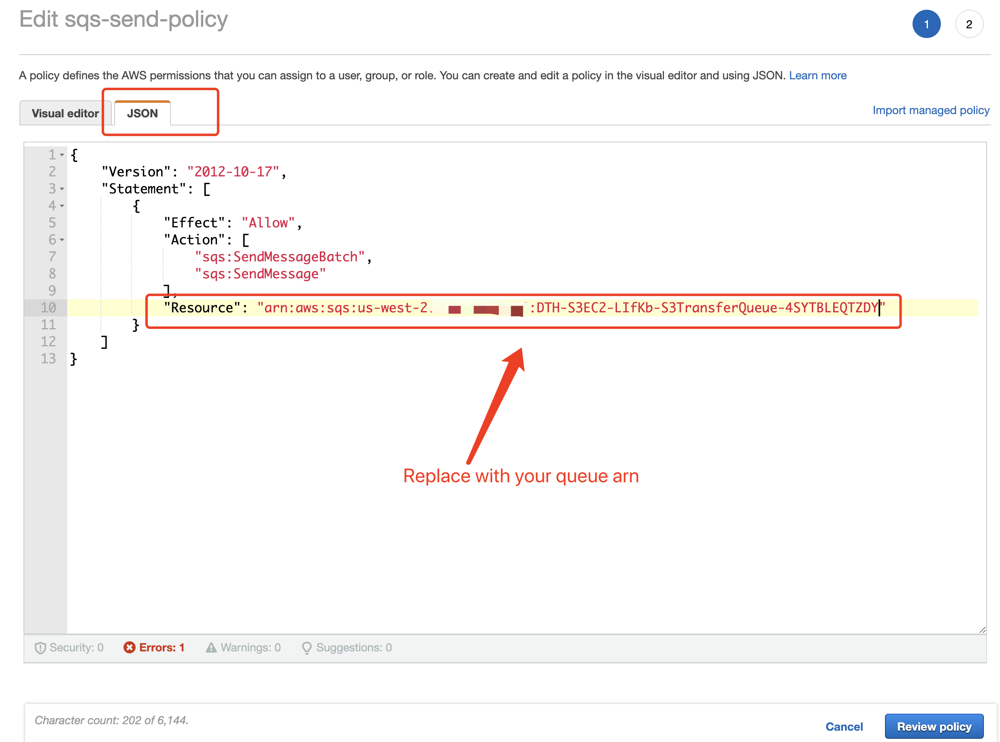
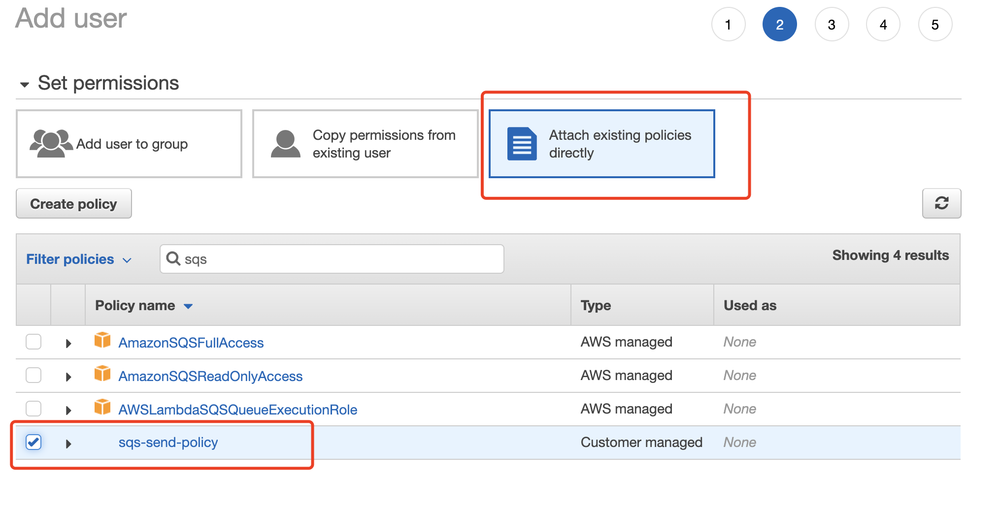
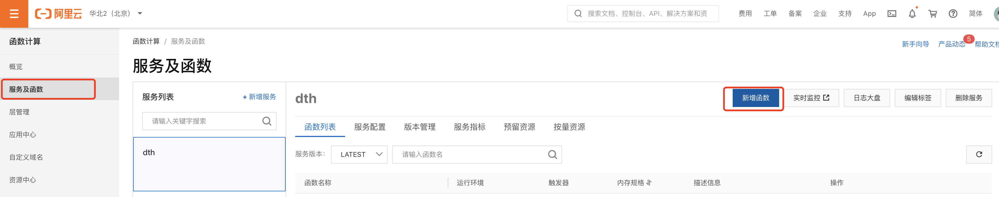
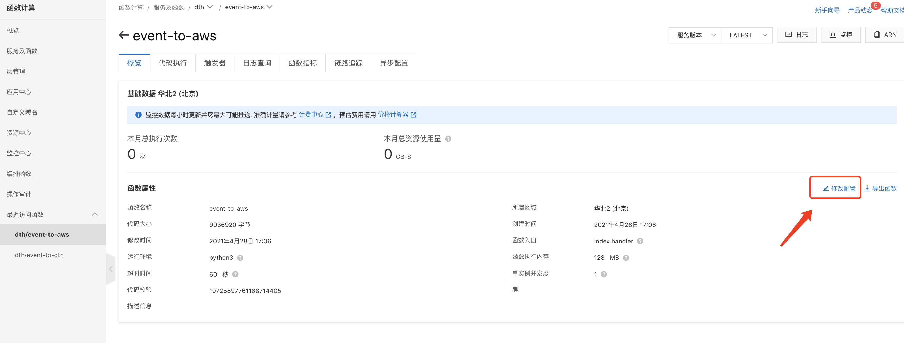
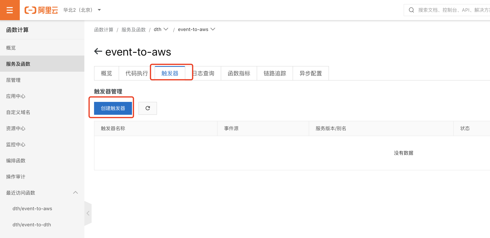
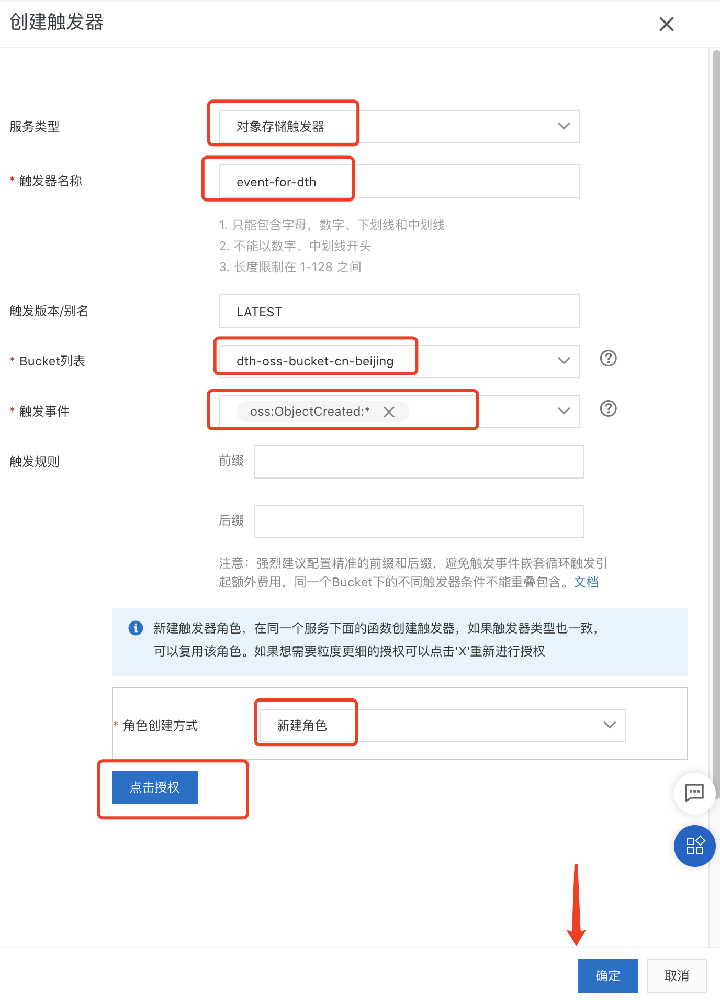

# 将阿里云 OSS 中的数据迁移到 Amazon S3
本教程为将数据从 **阿里云 OSS** 中的数据传输到的 **Amazon S3** 指南。

我们假设您已经完成了Data Transfer Hub解决方案的部署。 并将解决方案部署在 **俄勒冈州（us-west-2）** 区域。

您可以预先参考[部署指南](../README.md)部署该解决方案.


## 登陆到 Data Transfer Hub 界面
成功创建cloudformation堆栈后，您将收到一封电子邮件通知，其中包含用于登录的临时密码，用户名是您启动cloudformation时设置的AdminEmail。

界面的网址可在cloudformation堆栈的输出选项中找到，请参见以下屏幕截图：


### 登陆界面

1. 在浏览器中输入界面的URL
2. 使用您的用户名和临时密码登录
3. 更改临时密码
4. 验证电子邮件（可选）


## 配置凭证
1. 打开 **[Systems Manager](https://us-west-2.console.aws.amazon.com/systems-manager/home?region=us-west-2#)** 控制台

2. 点击左侧边栏的 **Parameter Store** 
3. 点击 **Create parameter** 按钮

4. 输入参数名称 **Name**, 例如: `drh-credentials`
5. 在参数类型上，选择 **SecureString**
6. 在 **Value**部分输入您的阿里云的AKSK, 该凭证需要按以下的格式
```
{
  "access_key_id": "<Your Access Key ID>",
  "secret_access_key": "<Your Access Key Secret>"
}
```


## 在网页界面中创建数据迁移任务
1. 回到 Data Transfer Hub 网页界面, 选择Amazon S3 然后点击 **Next Step**.


2. 在选择引擎类型时，我们建议选择 `EC2 Graviton 2`, 然后点击 **Next Step**.


3. 在 **数据源（Source settings）** 部分, 输入源数据桶的桶名以及相关参数信息，注意选择Source Type 为Aliyun OSS. 


4. 在 **数据目的地（Destination settings）** 部分, 输入目的地数据桶的名称以及相关参数信息.


5. 输入告警邮箱然后点击 **下一步（Next Step）**


6. 在检查完任务配置后，点击 **创建任务（Create Task）**. 随后，您将看到您所创建的任务.


## 通过Cloudwatch 面板进行监控
点击任务下对应的CloudWatch链接，打开CloudWatch 面板对任务的相关数据进行监控。

注意，任务第一次启动时，面板的监控指标数据可能会有5分钟左右的延迟。


## 通过OSS事件触发器进行实时数据迁移

如果您想将数据实时地从阿里云OSS迁移到Amazon S3。 下面是如何启用OSS事件触发迁移的指南。

### 预备工作
Data Transfer Hub 必须部署在AWS的账户中，本教程假设您部署在 **us-west-2** 区域.

在您创建了task之后，前往 [SQS 控制台](https://us-west-2.console.aws.amazon.com/sqs/v2/home?region=us-west-2#/queues) 并记下 `Queue URL` 和 `Queue arn`, 我们将在后续步骤中用到他们. 


### 准备您的AWS账户的 AK/SK
前往 [IAM 控制台](https://console.aws.amazon.com/iam/home?region=us-west-2), 点击 **创建一个新的策略（Create Policy）**.


点击 **JSON**，并将下面的权限Json文件输入到策略中。

**注意替换JSON中的Queue arn 为您前述步骤中的arn**

```json
{
    "Version": "2012-10-17",
    "Statement": [
        {
            "Effect": "Allow",
            "Action": [
                "sqs:SendMessageBatch",
                "sqs:SendMessage"
            ],
            "Resource": "arn:aws:sqs:us-west-2:xxxxxxxxxxx:DTHS3Stack-S3TransferQueue-1TSF4ESFQEFKJ"
        }
    ]
}
```



随后创建一个User. 前往 [User 控制台](https://console.aws.amazon.com/iam/home?region=us-west-2#/users) 然后点击 **添加用户（Add User）**. 


然后将您先前创建的策略附加到该用户上。  



保存 **AK/SK**，您将在下一步中使用它们。


### 准备阿里云中的发送函数

打开终端并输入以下命令，建议使用docker或linux机器。

```shell
mkdir tmp
cd tmp
pip3 install -t . boto3
```
随后在同一文件夹中创建 `index.py`，然后输入代码

```python
import json
import logging
import os
import boto3


def handler(event, context):
    logger = logging.getLogger()
    logger.setLevel('INFO')

    evt = json.loads(event)

    if 'events' in evt and len(evt['events']) == 1:
        evt = evt['events'][0]

        logger.info('Got event {}'.format(evt['eventName']))
        obj = evt['oss']['object']
        # logger.info(obj)

        ak = os.environ['ACCESS_KEY']
        sk = os.environ['SECRET_KEY']
        queue_url = os.environ['QUEUE_URL']
        region_name = os.environ['REGION_NAME']

        # minimum info of a message
        obj_msg = {
            'key': obj['key'],
            'size': obj['size']
        }

        # start sending the msg
        sqs = boto3.client('sqs', region_name=region_name,
                           aws_access_key_id=ak, aws_secret_access_key=sk)

        try:
            sqs.send_message(
                QueueUrl=queue_url,
                MessageBody=json.dumps(obj_msg)
            )
        except Exception as e:
            logger.error(
                'Unable to send the message to Amazon SQS, Exception:', e)

    else:
        logger.warning('Unknown Message '+evt)

    return 'Done'
```

打包代码（包括boto3）

```shell
zip -r code.zip *
```
### 在阿里云上创建函数

打开阿里云 [函数计算/Function Compute](https://fc.console.aliyun.com/fc/overview/)的服务及函数, 点击 **新建函数/create function**



运用刚刚打包的zip文件创建函数


然后点击 **新建/create**

### 配置函数的环境变量
点击 **修改配置/Edit Config**



然后在“环境变量”中输入json配置文件，请记住使用自己的`ACCESS_KEY`，`SECRET_KEY`和`QUEUE_URL`

```json
{
    "ACCESS_KEY": "XXX",
    "QUEUE_URL": "https://sqs.us-west-2.amazonaws.com/xxxx/DTHS3Stack-S3TransferQueue-xxxx",
    "REGION_NAME": "us-west-2",
    "SECRET_KEY": "XXXXX"
}
```


### 创建触发器

点击**创建触发器**以创建函数的触发器。



然后配置触发器，如下图所示。

