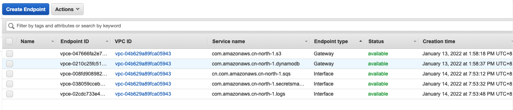

本教程介绍如何通过 Direct Connect (DX) 运行 Data Transfer Hub (DTH)。

DTH Worker Node 和 Finder Node 启动时，默认需要从 Internet 下载相关文件（如 CloudWatch 代理、DTH CLI）。在隔离场景下，您需要手动将文件下载并上传到 DTH 所在区域的 S3 存储桶中。

使用 DTH 通过 DX 传输数据有两种方式：

- [在非隔离网络环境下通过Direct Connect使用DTH进行数据传输](#default-network)
- [在隔离网络环境下通过Direct Connect使用DTH进行数据传输](#isolated-network)

## 在非隔离网络环境下通过Direct Connect使用DTH进行数据传输 <a name="default-network"></a>

在这种情况下，DTH 部署在**目标端**，并在一个具有**公共访问权限**（具有 Internet 网关或 NAT）的 VPC 内。数据源桶在隔离的网络环境中。

!!! note "说明"

    由于 DTH 部署 VPC 具有公共 Internet 访问权限（IGW 或 NAT），EC2 Worker/Finder器节点可以访问 DTH 使用的其他 AWS 服务，例如Secrets Manager等，并从 Internet 下载相关资源（例如 CloudWatch 代理、DTH CLI），从而无需任何其他手动操作。

1. 从**创建传输任务**页面，选择**创建新任务**，然后选择**下一步**。
2. 在**引擎选项**页面的引擎下，选择**Amazon S3**，然后选择**下一步**。
3. 指定传输任务详细信息。
    - 在**源类型**下，选择**Amazon S3 Compatible Storage**。

4. 输入 **endpoint url**, 该参数必须填写接口端点url，如 `https://bucket.vpce-076205013d3a9a2ca-us23z2ze.s3.ap-east-1.vpce.amazonaws.com`。您可以在[VPC 终端节点 控制台](https://us-east-1.console.aws.amazon.com/vpc/home?region=us-west-2#Endpoints:vpcEndpointType=Interface) 的 DNS 名称部分找到对应的url.

5. 输入**存储桶名称**，并选择同步**整个存储桶**或**指定前缀的对象**或**多个指定前缀的对象**。

6. 设置目标端S3存储桶信息。

7. 在**引擎设置**中，验证信息，并在必要时修改信息。如果要进行增量数据传输，建议将**最小容量**设置为至少为1的值。

8. 在**任务调度设置**处，选择您的任务调度配置。
    - 如果要以固定频率配置定时任务，以实现定时对比两侧的数据差异，请选择**Fixed Rate**。
    - 如果要通过[Cron Expression](https://docs.aws.amazon.com/AmazonCloudWatch/latest/events/ScheduledEvents.html#CronExpressions)配置定时任务，以实现定时对比两侧的数据差异，请选择**Cron Expression**。
    - 如果只想执行一次数据同步任务，请选择**One Time Transfer**。

9. 在**高级选项**中，保留默认值。
10. 在**是否需要数据比对**处，选择您的任务配置。
    - 如果要跳过数据对比过程，传输所有文件，请选择**No**。
    - 如果只想同步有差异的文件，请选择**Yes**。

11. 在**通知邮箱**中提供电子邮件地址。

12. 选择**下一步**并查看您的任务参数详细信息。

13. 选择**创建任务**。

## 在隔离网络环境下通过Direct Connect使用DTH进行数据传输 <a name="isolated-network"></a>
在这种情况下，DTH 部署在**目标侧**，并且在一个**没有公共访问权限**VPC内（隔离 VPC）。同时数据源桶也在一个隔离的网络环境中。

### 准备工作
**配置VPC的相关Endpoint**

DTH worker/finder 节点还需要访问其他 AWS 服务。为此，请为 **DynamoDB** 和 **S3** 创建 **Gateway Endpoint**，为 **logs**、**SQS** 和 **Secret Managers** 创建**Interface Endpoint**。



**将所需文件上传到一个 S3 存储桶**

在隔离场景下，您需要手动将文件下载并上传到 DTH 所在区域的 S3 存储桶中。

1. 下载 [Amazon CloudWatch 代理](https://s3.amazonaws.com/amazoncloudwatch-agent/amazon_linux/arm64/latest/amazon-cloudwatch-agent.rpm) 和 [DTH CLI](https://aws-gcr-solutions.s3.amazonaws.com/data-transfer-hub-s3/latest/drhcli_1.0.1_linux_arm64.tar.gz)。

2. 创建DTH Worker的 CloudWatch 代理配置文件。您可以创建一个名为 `cw_agent_config.json` 的文件。
```json
{
    "agent": {
        "metrics_collection_interval": 60,
        "run_as_user": "root"
    },
    "logs": {
        "logs_collected": {
            "files": {
                "collect_list": [
                    {
                        "file_path": "/home/ec2-user/worker.log",
                        "log_group_name": "##log group##",
                        "log_stream_name": "Instance-{instance_id}"
                    }
                ]
            }
        }
    },
    "metrics": {
        "append_dimensions": {
            "AutoScalingGroupName": "${aws:AutoScalingGroupName}",
            "InstanceId": "${aws:InstanceId}"
        },
        "aggregation_dimensions": [
            [
                "AutoScalingGroupName"
            ]
        ],
        "metrics_collected": {
            "disk": {
                "measurement": [
                    "used_percent"
                ],
                "metrics_collection_interval": 60,
                "resources": [
                    "*"
                ]
            },
            "mem": {
                "measurement": [
                    "mem_used_percent"
                ],
                "metrics_collection_interval": 60
            }
        }
    }
}
```
3. 将这三个文件上传到部署 DTH 的区域中的一个 S3 存储桶。


### 部署 DTH S3-Plugin

我们建议使用 **DTH S3-plugin** 创建传输任务，而不是使用 DTH 控制台。

**从全球区域启动堆栈**

[](https://console.aws.amazon.com/cloudformation/home#/stacks/create/template?stackName=DTHS3Stack&templateURL=https://aws-gcr-solutions.s3.amazonaws.com/data-transfer-hub-s3/latest/DataTransferS3Stack-ec2.template)

**从中国区域启动堆栈**

[](https://console.amazonaws.cn/cloudformation/home#/stacks/create/template?stackName=DTHS3Stack&templateURL=https://aws-gcr-solutions.s3.cn-north-1.amazonaws.com.cn/data-transfer-hub-s3/latest/DataTransferS3Stack-ec2.template)


1. 为 **Source Type** 选择 **Amazon_S3**。

2. 输入 **Source Bucket**。

3. 如果需要的话，输入 **Source Prefix**。

4. 输入 **Source Endpoint URL**, 例如 `https://bucket.vpce-076205013d3a9a2ca-us23z2ze.s3.ap-east-1.vpce.amazonaws.com`。

5. 为 **Source In Current Account** 选择 **false**。

6. 在 **Source Credentials** 中输入[Secrets Manager](https://console.aws.amazon.com/secretsmanager/home) 中存储的密钥名称。

7. 为 **Enable S3 Event** 选择 **No**。

8. 配置**Destination Bucket**、**Destination Prefix**、**Destination Region**和**Destination in Current Account**。 如果目标存储桶在当前账户中，请将目标凭证留空。

9. 配置**告警邮件**。

10. 配置 **VPC ID** 和 **Subnet IDs**。

11. 其他参数保持默认，点击**下一步**。

12. 单击**下一步**。配置其他堆栈选项，例如标签（可选）。

13. 单击**下一步**。查看并勾选确认，然后单击**创建堆栈**开始部署。

部署预计用时3到5分钟。

### 为 Worker 节点和 Finder 节点更新 EC2 Userdata

**更新 Worker 节点的Userdata**

1. 前往Auto Scaling Group的 [Launch configurations](https://us-west-2.console.aws.amazon.com/ec2/v2/home?region=us-west-2#LaunchConfigurations:launchConfigurationName=)。

2. 选择所要更改的Config并点击 **Copy Launch Configuration**。

3. 编辑**Advanced details** 部分下的 **User data** 。
    - 使用下面的 shell 脚本替换 `echo "export JOB_TABLE_NAME=xxxxxxxxxxx" >> env.sh`之前的代码。


    ```shell
    #!/bin/bash

    yum update -y
    cd /home/ec2-user/
    asset_bucket=<asset_bucket_name>
    aws s3 cp "s3://$asset_bucket/cw_agent_config.json" . --region <deploy_region_name>
    aws s3 cp "s3://$asset_bucket/amazon-cloudwatch-agent.rpm" .  --region <deploy_region_name>
    aws s3 cp "s3://$asset_bucket/dthcli_1.0.1_linux_arm64.tar.gz" .  --region <deploy_region_name>

    sudo yum install -y amazon-cloudwatch-agent.rpm
    sed -i  -e "s/##log group##/<worker_log_group_name>/g" cw_agent_config.json
    /opt/aws/amazon-cloudwatch-agent/bin/amazon-cloudwatch-agent-ctl -a fetch-config -m ec2 -c file:/home/ec2-user/cw_agent_config.json -s
    tar zxvf dthcli_1.0.1_linux_arm64.tar.gz

    ```

    - 请将 `<asset_bucket_name>` 替换为您存储前述文件的特定存储桶名称。

    - 将 `<deploy_region_name>` 替换为部署 DTH S3-Plugin 解决方案的区域。

    - 将 `<woker_log_group_name>` 替换为 DTH Worker 的日志组名称。

    - 请不要编辑 `// Prepare the environment variables` 之后的代码。

4. 点击 **Create Launch Configuration**。

5. 前往 [Auto Scling Group](https://us-west-2.console.aws.amazon.com/ec2/v2/home?region=us-west-2#AutoScalingGroups:), 选择目标Auto Scaling Group 并点击 **Edit**。

6. 在 **Launch configuration** 部分, 选择在前述步骤汇总新建的launch configuration。 点击 **Update**。

7. 终止所有正在运行的 DTH 工作程序节点，Auto Scaling Group将使用新的用户数据启动新的Worker节点。

**更新 Finder 节点的Userdata**

1. 前往EC2 [Launch Templates](https://us-west-2.console.aws.amazon.com/ec2/v2/home?region=us-west-2#LaunchTemplates:)。

2. 点击 **Modify template**。

3. 在**Advanced details**部分，编辑**User data**.
    - 使用下面的 shell 脚本替换 `echo "export JOB_TABLE_NAME=xxxxxxxxxxx" >> env.sh`之前的代码。

    ```shell
    #!/bin/bash

    yum update -y
    cd /home/ec2-user/
    asset_bucket=<asset_bucket_name>
    aws s3 cp "s3://$asset_bucket/amazon-cloudwatch-agent.rpm" .  --region <deploy_region_name>
    aws s3 cp "s3://$asset_bucket/dthcli_1.0.1_linux_arm64.tar.gz" .  --region <deploy_region_name>

    echo "{\"agent\": {\"metrics_collection_interval\": 60,\"run_as_user\": \"root\"},\"logs\": {\"logs_collected\": {\"files\": {\"collect_list\": [{\"file_path\": \"/home/ec2-user/finder.log\",\"log_group_name\": \"##log group##\"}]}}}}" >> /home/ec2-user/cw_agent_config.json,

    sudo yum install -y amazon-cloudwatch-agent.rpm

    sed -i  -e "s/##log group##/<finder_log_group_name>`/g" cw_agent_config.json
    /opt/aws/amazon-cloudwatch-agent/bin/amazon-cloudwatch-agent-ctl -a fetch-config -m ec2 -c file:/home/ec2-user/cw_agent_config.json -s
    tar zxvf dthcli_1.0.1_linux_arm64.tar.gz

    ```

    - 请将 `<asset_bucket_name>` 替换为您存储前述文件的特定存储桶名称。

    - 将 `<deploy_region_name>` 替换为部署 DTH S3-Plugin 解决方案的区域。

    - 将 `<finder_log_group_name>` 替换为 DTH Finder 的日志组名称。

    - 请不要编辑 `echo "export JOB_TABLE_NAME=xxxxxxxxxxx" >> env.sh`后面的代码。

4. 点击 **Create template version**。

5. 使用这个新版本模板启动一个新的 Finder 节点，并手动终止旧的Finder节点。


## 架构图

[![architecture]][architecture]

[architecture]: ./images/dx-arch-global.png

在 EC2 上运行的 DTH Worker节点将数据从一个 AWS 账户中的存储桶传输到另一个 AWS 账户中的存储桶。

* 要访问当前账户中的存储桶（DTH 所部署侧），DTH Worker节点使用**S3 Gateway Endpoint**
* 要访问另一个账户中的存储桶，DTH Worker节点使用 **S3 Private Link** by **S3 Interface Endpoint**

