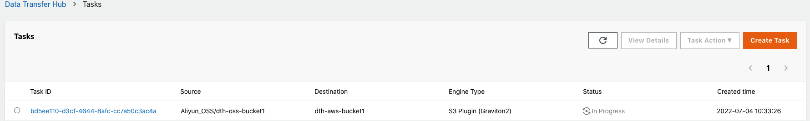

本教程介绍如何将 **阿里云 OSS** 中的数据传输到 **Amazon S3**。

## 前提条件
您已经完成了Data Transfer Hub解决方案的部署，并将解决方案部署在 **俄勒冈州（us-west-2）** 区域。更多信息请参考[部署解决方案](../../deployment/deployment-overview)。

## 步骤1: 为OSS配置凭证

1. 打开 **[Secrets Manager](https://console.aws.amazon.com/secretsmanager/home#)** 控制台。
1. 点击左侧边栏的**密钥**。
1. 点击**存储新的密钥**按钮。
1. 在密钥类型中，选择**其他类型的密钥**。
1. 在**明文**选项卡中输入您的阿里云的凭证，该凭证的格式如下：

    ```json
    {
    "access_key_id": "<Your Access Key ID>",
    "secret_access_key": "<Your Access Key Secret>"
    }
    ```

1. 点击**下一步**。
1. 输入**密钥名称**，例如: `dth-oss-credentials`。
1. 点击**下一步**。
1. 禁用**自动轮换**。
1. 点击**存储** 完成创建。

## 步骤2: 创建OSS传输任务
1. 从**创建传输任务**页面，选择**创建新任务**，然后选择**下一步**。

2. 在**引擎选项**页面的引擎下，选择**Amazon S3**，然后选择**下一步**。

3. 指定传输任务详细信息。
    - 在**源类型**下，选择数据源为 **Aliyun OSS**。

4. 输入**存储桶名称**，并选择同步**整个存储桶**或**指定前缀的对象**或**多个指定前缀的对象**。
    
5. 设置目标端S3存储桶信息。
    
6. 在**引擎设置**中，验证信息，并在必要时修改信息。如果要进行增量数据传输，建议将**最小容量**设置为至少为1的值。

7. 在**任务调度设置**处，选择您的任务调度配置。
    - 如果要以固定频率配置定时任务，以实现定时对比两侧的数据差异，请选择**Fixed Rate**。
    - 如果要通过[Cron Expression](https://docs.aws.amazon.com/AmazonCloudWatch/latest/events/ScheduledEvents.html#CronExpressions)配置定时任务，以实现定时对比两侧的数据差异，请选择**Cron Expression**。
    - 如果只想执行一次数据同步任务，请选择**One Time Transfer**。
    - 如果您想实现实时增量数据同步，请参考 [OSS事件配置](#oss-event).

8. 在**高级选项**中，保留默认值。
9. 在**是否需要数据比对**处，选择您的任务配置。
    - 如果要跳过数据对比过程，传输所有文件，请选择**No**。
    - 如果只想同步有差异的文件，请选择**Yes**。

10. 在**通知邮箱**中提供电子邮件地址。

11. 选择**下一步**并查看您的任务参数详细信息。

12. 选择**创建任务**。

任务创建成功后，会出现在**任务**页面。



图2：任务页面

选择**任务 ID**进入任务详情页面，然后选择**CloudWatch Dashboard**监控任务状态。

### 通过OSS事件触发器进行实时数据传输 <a name="oss-event"></a>

如果您想将数据实时地从阿里云OSS迁移到Amazon S3，可以按照以下步骤启用**OSS事件**触发器。

在您创建任务之后，前往 [SQS 控制台](https://us-west-2.console.aws.amazon.com/sqs/v2/home?region=us-west-2#/queues) 并记下 `Queue URL` 和 `Queue arn`，我们将在后续步骤中使用。

**准备您的AWS账户的AK/SK**

1. 前往 [IAM 控制台](https://console.aws.amazon.com/iam/home?region=us-west-2)。

2. 在导航窗格中选择**策略**，然后选择**创建一个新的策略（Create Policy）**。

3. 点击 **JSON**，并将下面的权限JSON文件输入到策略中。

    ```json
    {
        "Version": "2012-10-17",
        "Statement": [
            {
                "Effect": "Allow",
                "Action": [
                    "sqs:SendMessage"
                ],
                "Resource": "arn:aws:sqs:us-west-2:xxxxxxxxxxx:DTHS3Stack-S3TransferQueue-1TSF4ESFQEFKJ"
            }
        ]
    }
    ```
    !!! Note "说明"
        请替换JSON中您的queue ARN。

4. 完成创建策略。

5. 在导航窗格中，选择**用户**，然后选择**添加用户（Add User）**。 

6. 将您先前创建的策略关联到该用户上。  

7. 保存 **ACCESS_KEY/SECRET_KEY**，以备后面的步骤使用。

**准备阿里云中的事件发送函数**

1. 打开终端并输入以下命令，建议使用docker或linux机器。

    ```shell
    mkdir tmp
    cd tmp
    pip3 install -t . boto3
    ```

2. 在同一文件夹中创建 `index.py`，然后输入代码。

    ```python
    import json
    import logging
    import os
    import boto3


    def handler(event, context):
        logger = logging.getLogger()
        logger.setLevel('INFO')
        evt = json.loads(event)
        if 'events' in evt and len(evt['events']) == 1:
            evt = evt['events'][0]
            logger.info('Got event {}'.format(evt['eventName']))
            obj = evt['oss']['object']
            # logger.info(obj)
            ak = os.environ['ACCESS_KEY']
            sk = os.environ['SECRET_KEY']
            queue_url = os.environ['QUEUE_URL']
            region_name = os.environ['REGION_NAME']
            # minimum info of a message
            obj_msg = {
                'key': obj['key'],
                'size': obj['size']
            }
            # start sending the msg
            sqs = boto3.client('sqs', region_name=region_name,
                            aws_access_key_id=ak, aws_secret_access_key=sk)
            try:
                sqs.send_message(
                    QueueUrl=queue_url,
                    MessageBody=json.dumps(obj_msg)
                )
            except Exception as e:
                logger.error(
                    'Unable to send the message to Amazon SQS, Exception:', e)
        else:
            logger.warning('Unknown Message '+evt)

        return 'Done'
    ```

3. 打包代码（包括boto3）。

    ```shell
    zip -r code.zip *
    ```

**在阿里云上创建函数**

1. 打开阿里云 [函数计算](https://fc.console.aliyun.com/fc/tasks/)的服务及函数, 点击 **Task**。

2. 点击**创建函数**。

3. 选择 **Python3.x** 作为 **运行时环境变量**。

4. 选择 **上传ZIP包**作为代码上传方式。

5. 上传前述步骤中创建的`code.zip`。

6. 然后点击 **新建**。

**配置函数环境变量**

1. 点击**配置**。

2. 在**函数的环境变量**部分，点击 **修改配置**。

3. 然后在**环境变量**中输入json配置文件，请使用您自己的`ACCESS_KEY`，`SECRET_KEY`和`QUEUE_URL`。

    ```json
    {
        "ACCESS_KEY": "XXX",
        "QUEUE_URL": "https://sqs.us-west-2.amazonaws.com/xxxx/DTHS3Stack-S3TransferQueue-xxxx",
        "REGION_NAME": "us-west-2",
        "SECRET_KEY": "XXXXX"
    }
    ```

4. 点击**OK**。

**创建触发器**

1. 在**触发器**页签中点击**创建触发器**以创建函数的触发器。

    

2. 选择**OSS**作为触发器类型，然后选择桶名称。

3. 选择**触发事件**。

    ```
    oss:ObjectCreated:PutObject
    oss:ObjectCreated:PostObject 
    oss:ObjectCreated:CopyObject
    oss:ObjectCreated:CompleteMultipartUpload
    oss:ObjectCreated:AppendObject
    ```

4. 点击**OK**。