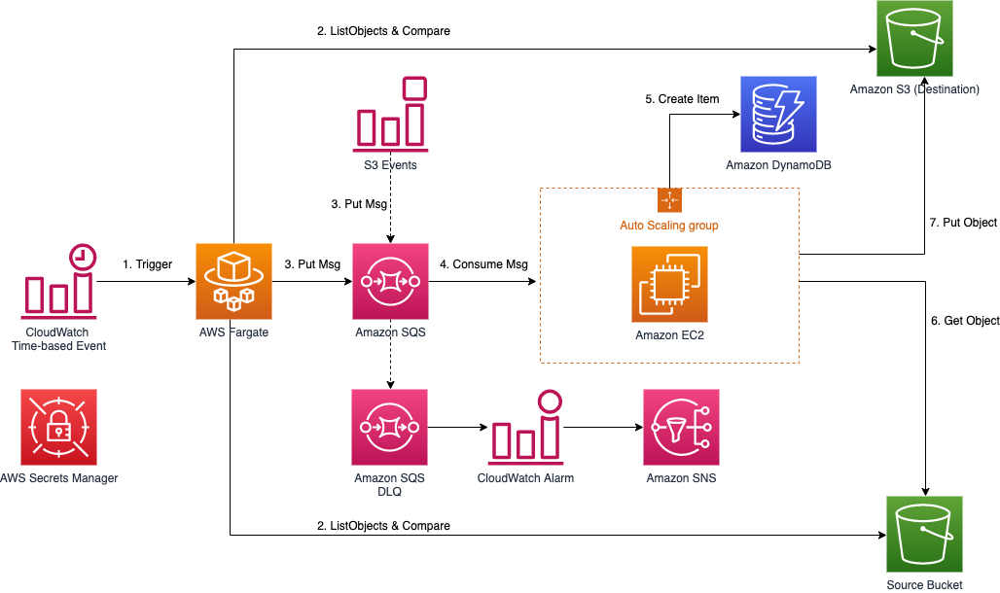
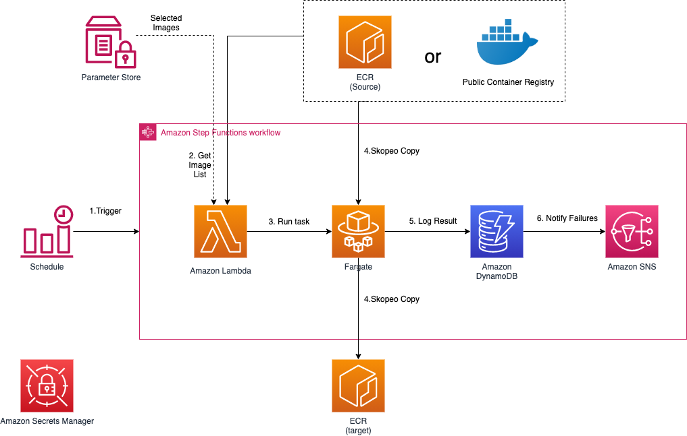

下图展示的是使用默认参数部署本解决方案在亚马逊云科技中构建的环境。

      
图1：Data Transfer Hub方案架构

本解决方案在您的亚马逊云科技账户中部署Amazon CloudFormation模板并完成以下设置。

1. 该解决方案的静态Web资源（前端用户界面）存储在Amazon S3中，并通过Amazon CloudFront提供静态资源的分发。
1. 后端API通过AWS AppSync GraphQL提供。
1. 用户通过Amazon Cognito用户池（在AWS区域）或OpenID连接提供商（在AWS中国区域）进行身份验证，例如Authing、Auth0等。
1. AWS AppSync通过AWS Lambda来调用后端API。
1. Lambda 启动AWS Step Functions工作流，该工作流使用AWS CloudFormation启动或停止/删除ECR或S3插件模板。
1. 插件模板托管在由Amazon S3存储桶中。
1. 该解决方案还预置了一个Amazon ECS集群，该集群运行插件模板使用的容器镜像，并且容器镜像托管在Amazon ECR中。
1. 数据传输任务信息存储在Amazon DynamoDB中。

> 注意：如果您在北京光环新网（光环新网）运营的AWS（北京）区域或宁夏西云数据技术有限公司（西云数据）运营的AWS（宁夏）区域部署本解决方案，您需要预先准备具有ICP记录的域。

Web控制台是创建和管理所有数据传输任务的集中位置。每种数据类型（例如，Amazon S3或Amazon ECR）都是Data Transfer Hub的插件，并打包为AWS CloudFormation模板，托管在AWS的S3存储桶中。当您创建传输任务时，AWS Lambda函数会启动Amazon CloudFormation模板，并且每个任务的状态都会存储并显示在DynamoDB 表中。

截至2021年12月，该解决方案支持两个数据传输插件：Amazon S3插件和Amazon ECR插件。
## Amazon S3 插件

图2：Data Transfer Hub Amazon S3插件方案架构

Amazon S3插件运行以下工作流程：
1. Event Bridge规则定时触发AWS Fargate任务，默认每小时运行一次。
1. Fargate任务列出源和目标存储桶中的所有对象，并确定应传输哪些对象。
1. Fargate为每个将传输到Amazon Simple Queue Service(Amazon SQS)的对象发送一条消息。同时该方案还支持Amazon S3事件消息，以实现更实时的数据传输；每当有对象上传到源存储桶时，事件消息就会发送到同一个 SQS 队列。
1. 在EC2中运行的JobWorker使用SQS中的消息，并将对象从源存储桶传输到目标存储桶。该方案将使用Auto Scaling Group来控制EC2实例的数量，以根据业务需要传输数据。
1. 每个对象的传输状态记录存储在Amazon DynamoDB中。
1. Amazon EC2实例将根据SQS消息从源存储桶中获取（下载）对象。
1. EC2实例将根据SQS消息将对象放入（上传）到目标存储桶。

> 注意：如果对象（或对象的一部分）传输失败，JobWorker释放队列中的消息，待消息在队列中可见后再次传输对象（默认可见性超时设置为 15 分钟）。 如果再次传输失败，则将消息发送到死信队列并发送通知警报。

## Amazon ECR plugin

图3：Data Transfer Hub Amazon ECR插件方案架构

Amazon ECR插件运行以下工作流程：

1. EventBridge规则定期运行AWS Step Functions工作流（默认情况下，它每天运行）。
1. Step Functions调用AWS Lambda从源检索镜像列表。
1. Lambda将列出源Amazon ECR中的所有存储库内容，或从System Manager Parameter Store获取存储的镜像列表。
1. 传输任务将在Fargate内以最大10的并发运行。如果传输任务因某种原因失败，它将自动重试3次。
1. 每个任务使用skopeo copy将镜像复制到目标ECR中。
1. 复制完成后，状态（成功或失败）会记录到DynamoDB中以进行跟踪。